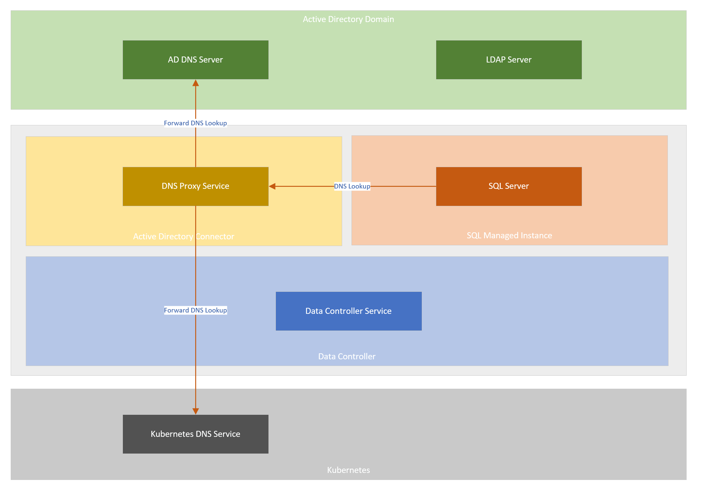

# Introduction to Azure Arc-enabled SQL Managed Instance with Active Directory authentication 

This article describes Azure Arc-enabled SQL Managed Instance with Active Directory (AD) Authentication by bring your own keytab (BYOK) where the user is expected to provide a pre-created Active Directory account, Service Principal Names and Keytab.

## Background

In order to support Active Directory authentication for SQL Managed Instance, a SQL Managed Instance must be deployed in an environment that allows it to communicate with the Active Directory domain.
To facilitate this, a new Kubernetes-native [Custom Resource definition (CRD)](https://kubernetes.io/docs/concepts/extend-kubernetes/api-extension/custom-resources/), in the yaml definition file, by specifying the 'Kind' called "Active Directory Connector" is introduced. An Active Directory Connector custom resource stores the information needed to enable connections to DNS and AD for purposes of authenticating users and service accounts.

This custom resource deploys a DNS proxy service that mediates between the SQL Managed Instance DNS resolver and the two upstream DNS servers:

1. Kubernetes DNS servers
2. Active Directory DNS servers

When a SQL Managed Instance is deployed with Active Directory Authentication enabled, it will reference the Active Directory Connector instance it wants to use. Referencing the Active Directory Connector in SQL MI spec will automatically set up the needed environment in the SQL Managed Instance container for SQL MI to perform Active Directory authentication.

## Active Directory Connector and SQL Managed Instance

## Bring Your Own Keytab (BYOK) 

The following are the steps for user to set up:

1. Creating and providing an Active Directory account for each SQL Managed Instance that must accept AD authentication.
1. Providing a DNS name belonging to the Active Directory DNS domain for the SQL Managed Instance endpoint.
1. Creating a DNS record in Active Directory for the SQL endpoint.
1. Providing a port number for the SQL Managed Instance endpoint.
1. Registering Service Principal Names (SPNs) under the AD account in Active Directory domain for the SQL endpoint.
1. Creating and providing a keytab file for SQL Managed Instance containing entries for the AD account and SPNs.

## Next steps

* [Deploying Active Directory (AD) Connector](deploy-active-directory-connector.md)
* [Deploying Arc-enabled SQL Managed Instance in Active Directory (AD) Manual Authentication mode](deploy-active-directory-sqlmi.md)
* [Connect to AD-integrated Azure Arc-enabled SQL Managed Instance](connect-active-directory-sqlmi.md)
