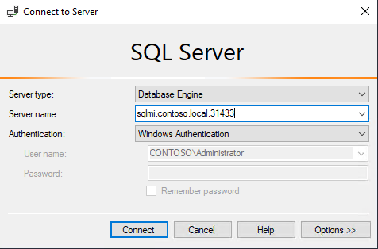

# Connect to AD-integrated Azure Arc-enabled SQL Managed Instance

This article describes how to connect to SQL Managed Instance endpoint using Active Directory (AD) authentication. Before you proceed, make sure you have an AD-integrated Azure Arc-enabled SQL Managed Instance deployed already.

See [Tutorial – Deploy AD-integrated SQL Managed Instance (Bring Your Own Keytab)](deploy-active-directory-sqlmi.md) to deploy a Azure Arc-enabled SQL Managed Instance with Active Directory (AD) Authentication enabled.

## Create Active Directory logins in SQL Managed Instance

Once SQL Managed Instance is successfully deployed, you will need to provision AD logins in SQL Server.
In order to do this, first connect to the SQL Managed Instance using the SQL login with administrative privileges and run the following TSQL:

```console
CREATE LOGIN [<NetBIOS domain name>\<AD account name>] FROM WINDOWS;
GO
```

For an AD domain `contoso.local` with NetBIOS domain name as `CONTOSO`, if you want to create a login for AD account `admin`, the command should look like the following:

```console
CREATE LOGIN [CONTOSO\admin] FROM WINDOWS;
GO
```

## Connect to Azure Arc-enabled SQL Managed Instance

From your domain joined Windows-based or Linux-based client machine, you can use `sqlcmd` utility, or open [SQL Server Management Studio](/sql/ssms/download-sql-server-management-studio-ssms) or [Azure Data Studio (ADS)](/sql/azure-data-studio/download-azure-data-studio) to connect to the Azure Arc-enabled SQL Managed Instance using AD authentication.

### Connect from Linux/Mac OS

To connect from a Linux/Mac OS client, authenticate to Active Directory using the kinit command and then use sqlcmd tool to connect to the SQL Managed Instance.

```bash
kinit <username>@<REALM>
sqlcmd -S <Endpoint DNS name>,<Endpoint port number> -E
```

For connecting using the `CONTOSO\admin` AD account to the SQL Managed Instance with endpoint sqlmi.contoso.local at port 31433, the '-E' is used when using the integrated authentification, the commands should look like the following: 

```bash
kinit admin@CONTOSO.LOCAL
sqlcmd -S sqlmi.contoso.local,31433 -E
```

## Connect to SQL MI instance from Windows

From Windows, when you run the following command, the AD identity you are logged in to Windows with should be picked up automatically for connecting to SQL Managed Instance.

```bash
sqlcmd -S <DNS name for master instance>,31433 -E
```

## Connect to SQL MI instance from SSMS



## Connect to SQL MI instance from ADS


