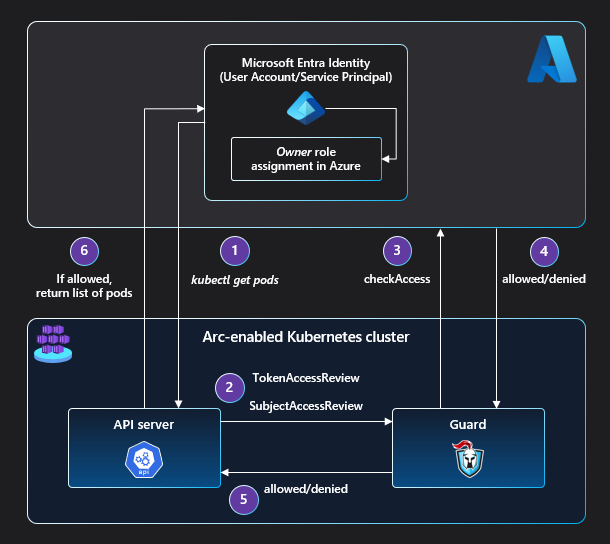

# Azure RBAC on Azure Arc-enabled Kubernetes

Kubernetes [ClusterRoleBinding and RoleBinding](https://kubernetes.io/docs/reference/access-authn-authz/rbac/#rolebinding-and-clusterrolebinding) object types help to define authorization in Kubernetes natively. With Azure RBAC, you can use Azure Active Directory (Azure AD) and role assignments in Azure to control authorization checks on the cluster. This allows the benefits of Azure role assignments, such as activity logs showing all Azure RBAC changes to an Azure resource, can be used with your Azure Arc-enabled Kubernetes cluster.

## Architecture

In order to route all authorization access checks to the authorization service in Azure, a webhook server ([guard](https://github.com/appscode/guard)) is deployed on the cluster.

The `apiserver` of the cluster is configured to use [webhook token authentication](https://kubernetes.io/docs/reference/access-authn-authz/authentication/#webhook-token-authentication) and [webhook authorization](https://kubernetes.io/docs/reference/access-authn-authz/webhook/) so that `TokenAccessReview` and `SubjectAccessReview` requests are routed to the guard webhook server. The `TokenAccessReview` and `SubjectAccessReview` requests are triggered by requests for Kubernetes resources sent to the `apiserver`.

Guard then makes a `checkAccess` call on the authorization service in Azure to see if the requesting Azure AD entity has access to the resource of concern.

If that entity has a role that permits this access, an `allowed` response is sent from the authorization service to guard. Guard, in turn, sends an `allowed` response to the `apiserver`, enabling the calling entity to access the requested Kubernetes resource.

If the entity doesn't have a role that permits this access, a `denied` response is sent from the authorization service to guard. Guard sends a `denied` response to the `apiserver`, giving the calling entity a 403 forbidden error on the requested resource.

## Next steps

* Use our quickstart to [connect a Kubernetes cluster to Azure Arc](./quickstart-connect-cluster.md).
* [Set up Azure RBAC](./azure-rbac.md) on your Azure Arc-enabled Kubernetes cluster.
