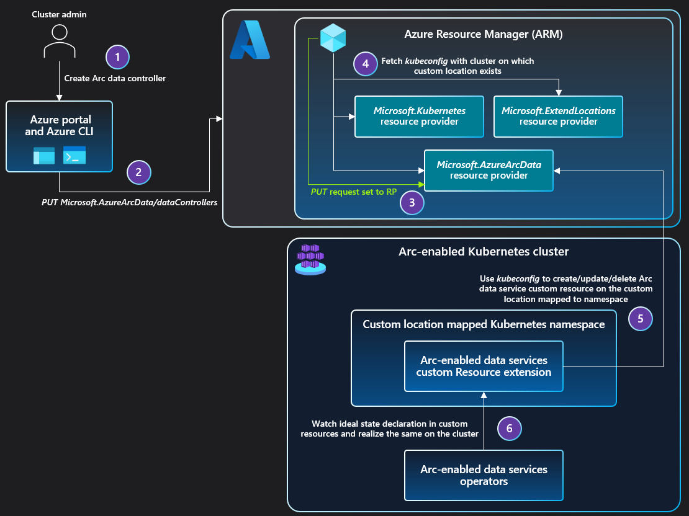

# Custom locations on Azure Arc enabled Kubernetes

The Custom Locations is an extension of Azure location. It provides a way for tenant administrators to utilize their Azure Arc enabled Kubernetes clusters as target locations to deploy instances of Azure services. Examples of such Azure resources are Azure Arc enabled SQL Managed Instance and Azure Arc enabled PostgreSQL Hyperscale. Similar to locations, end users within the tenant who have access to Custom Locations can deploy resources there using their company's private compute.

Custom location can be visualized as an abstraction layer on top of Azure Arc enabled Kubernetes cluster, cluster connect and cluster extensions. It's responsible for creation of granular [RoleBindings and ClusterRoleBindings](https://kubernetes.io/docs/reference/access-authn-authz/rbac/#rolebinding-and-clusterrolebinding) needed for other Azure services to access the cluster. They need access to the cluster so that they can manage the resources which the customer wants to deploy on their clusters.

[!INCLUDE [preview features note](./includes/preview/preview-callout.md)]

## Architecture

When the admin enables custom locations feature on the cluster, a ClusterRoleBinding is created on the cluster authorizing the AAD application used by the Custom Locations Resource Provider (RP). This is needed so that Custom Locations RP can create ClusterRoleBindings or RoleBindings needed by other Azure RPs to create custom resources on this cluster. The list of RPs to authorize is determined based on the cluster extensions installed on the cluster.

When the user creates a Data service instance on the cluster, the PUT request is sent to Azure Resource Manager, from where it's then sent to the Azure Arc enabled Data Services RP. This RP then fetches the `kubeconfig` file associated with the Azure Arc enabled Kubernetes cluster on which the custom location (referenced as extended location in the original PUT request) exists. This `kubeconfig` is then used to communicate with the cluster to create a custom resource of the Azure Arc enabled Data Services type on the namespace mapped to the custom location. The Azure Arc enabled Data Services operator was deployed by the creation of cluster extension before creation of the custom location. This operator read the new custom resource created on the cluster and and then translates this into realization of the desired state on the cluster by creating the data controller. The request flow to create the SQL managed instance and PostgreSQL instance are identical to the sequence of steps described above.

## Next steps

* Walk through our quickstart to [connect a Kubernetes cluster to Azure Arc](./quickstart-connect-cluster.md).
* Already have a Kubernetes cluster connected to Azure Arc? [Create a custom location on your Arc enabled Kubernetes cluster](./custom-locations.md).