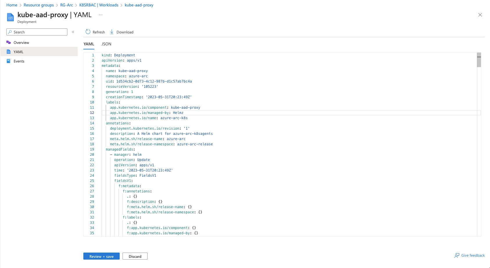

# Access Kubernetes resources from Azure portal

The Azure portal includes a Kubernetes resource view for easy access to the Kubernetes resources in your Azure Arc-enabled Kubernetes cluster. Viewing Kubernetes resources from the Azure portal reduces context switching between the Azure portal and the `kubectl` command-line tool, streamlining the experience for viewing and editing your Kubernetes resources. The resource viewer currently includes multiple resource types, such as deployments, pods, and replica sets.

## Prerequisites

1. An existing Kubernetes cluster [connected](quickstart-connect-cluster.md) to Azure as an Azure Arc-enabled Kubernetes resource.

2. [Cluster Connect feature has to be enabled](cluster-connect.md#enable-cluster-connect-feature) on the Azure Arc-enabled Kubernetes cluster.

3. [Service account token](cluster-connect.md#service-account-token-authentication-option) for authentication to the cluster.

## View Kubernetes resources

To see the Kubernetes resources, navigate to your AKS cluster in the Azure portal. The navigation pane on the left is used to access your resources. The resources include:

- **Namespaces** displays the namespaces of your cluster. The filter at the top of the namespace list provides a quick way to filter and display your namespace resources.
- **Workloads** shows information about deployments, pods, replica sets, stateful sets, daemon sets, jobs, and cron jobs deployed to your cluster.
- **Services and ingresses** shows all of your cluster's service and ingress resources.
- **Storage** shows your Azure storage classes and persistent volume information.
- **Configuration** shows your cluster's config maps and secrets.

## Edit YAML

The Kubernetes resource view also includes a YAML editor. A built-in YAML editor means you can update Kubernetes objects from within the portal and apply changes immediately.

After editing the YAML, changes are applied by selecting **Review + save**, confirming the changes, and then saving again.

>[!WARNING]
> Performing direct production changes via UI or CLI is not recommended and you should consider using [Configurations (GitOps)](tutorial-use-gitops-connected-cluster.md) for production environments. The Azure portal Kubernetes management capabilities and the YAML editor are built for learning and flighting new deployments in a development and testing setting.

## Next steps

Azure Monitor for containers provides more in-depth information about nodes and containers of the cluster when compared to the logical view of the Kubernetes resources available with Kubernetes resources view described in this article. Learn how to [deploy Azure Monitor for containers](../../azure-monitor/containers/container-insights-enable-arc-enabled-clusters.md?toc=/azure/azure-arc/kubernetes/toc.json) on your cluster.