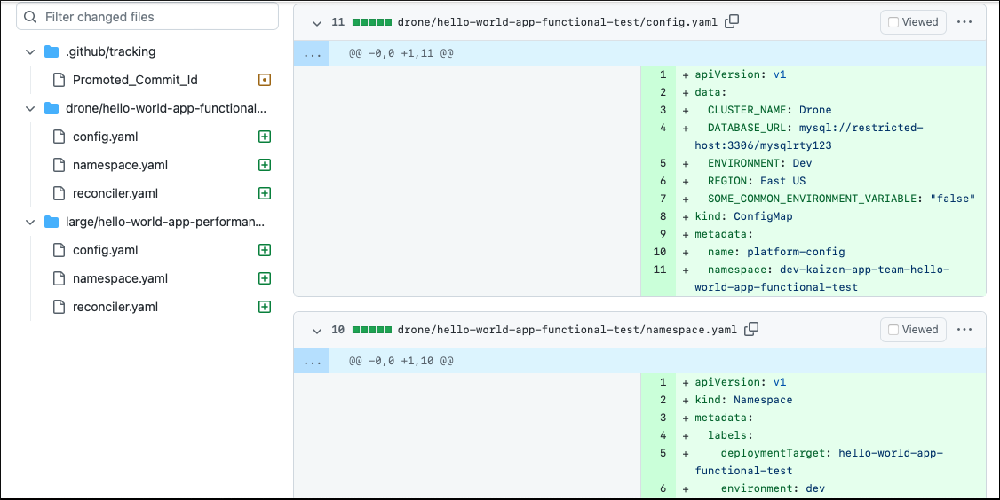
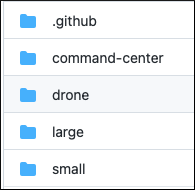
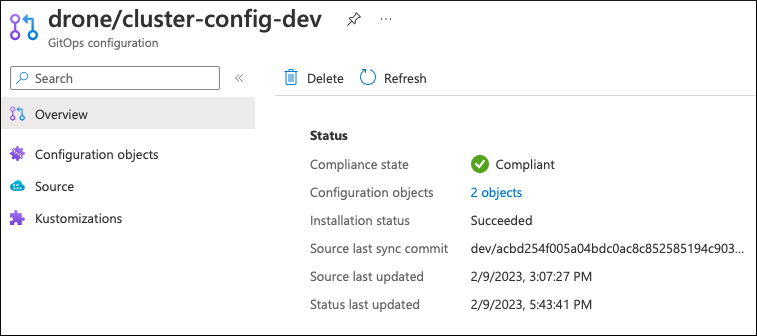
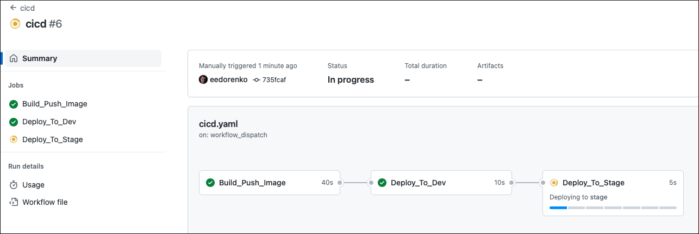
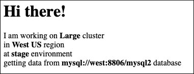
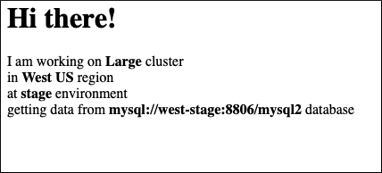

# Tutorial: Workload management in a multi-cluster environment with GitOps

This tutorial will walk you through typical scenarios of the workload deployment and configuration in a multi-cluster Kubernetes environment. It will show how to use [Kalypso](https://github.com/microsoft/kalypso) GitHub repositories setup and toolings from the perspective of the `Platform Team` and `Application Dev Team` personas in their daily activities. 

## Installation options and requirements
 
The tutorial is built in the way that you first deploy a starting point sample infrastructure, with a few GitHub repositories and AKS clusters, and then it guides you through a set of use-cases where you act as different personas. 

### Prerequisites

In order to successfully deploy the sample, you need the following:

- [Azure CLI](/cli/azure/install-azure-cli).
- An Azure account with an active subscription. [Create one for free](https://azure.microsoft.com/free).
- [gh cli](https://cli.github.com)
- [Helm](https://helm.sh/docs/helm/helm_install/)
- [kubectl](https://kubernetes.io/docs/tasks/tools/#kubectl)

### Deployment

To deploy the sample run the following script:

```azurecli-interactive
mkdir kalypso && cd kalypso
curl -fsSL -o deploy.sh https://raw.githubusercontent.com/microsoft/kalypso/main/deploy/deploy.sh
chmod 700 deploy.sh
./deploy.sh -c -p <preix. e.g. kalypso> -o <github org. e.g. eedorenko> -t <github token> -l <azure-location. e.g. westus2> 
```

Since AKS clusters provisioning is not the fastest process in the world, the script will really take it time. Once it's done, it will report the execution result in an output like this:

```azurecli-interactive
Depoyment is complete!
---------------------------------
Created repositories:
  - https://github.com/eedorenko/kalypso-control-plane
  - https://github.com/eedorenko/kalypso-gitops
  - https://github.com/eedorenko/kalypso-app-src
  - https://github.com/eedorenko/kalypso-app-gitops
---------------------------------
Created AKS clusters in kalypso-rg resource group:
  - control-plane
  - drone (Azure Arc Flux based workload cluster)
  - large (ArgoCD based workload cluster)
---------------------------------  
```

> [!NOTE]
> If something goes wrong with the deployment, you can always delete created resources with the following command:
> ```azurecli-interactive
> ./deploy.sh -d -p <preix. e.g. kalypso> -o <github org. e.g. eedorenko> -t <github token> -l <azure-location. e.g. westus2> 
> ```

## Sample overview

First of all, let's explore what we have deployed. The deployment script created an infrastructure, shown on the following diagram:


There are a few `Platform Team` repositories:

- [Control Plane](https://github.com/microsoft/kalypso-control-plane) - Contains a platform model defined with high level abstractions, such as environments, cluster types, applications and services, mapping rules and configurations, promotion workflows.
- [Platform GitOps](https://github.com/microsoft/kalypso-gitops) - Contains final manifests representing the topology of the fleet - what cluster types are available in each environment, what workloads are scheduled on them and what platform configuration values are set.
- [Services Source](https://github.com/microsoft/kalypso-svc-src) - Contains high level manifest templates of sample dial-tone platform services.
- [Services GitOps](https://github.com/microsoft/kalypso-svc-gitops) - Contains final manifests of sample dial-tone platform services to be deployed across the clusters.

And a couple of the `Application Dev Team` repositories:

- [Application Source](https://github.com/microsoft/kalypso-app-src) - Contains a sample application source code including Docker files, manifest templates and CI/CD workflows.
- [Application GitOps](https://github.com/microsoft/kalypso-app-gitops) - Contains final sample application manifests to be deployed to the deployment targets.

The script created the following AKS clusters:

- `control-plane` - This cluster doesn't run any workloads. It's a management cluster. It hosts [Kalypso Scheduler](https://github.com/microsoft/kalypso-scheduler) operator that transforms high level abstractions from the [Control Plane](https://github.com/microsoft/kalypso-control-plane) repository to the raw Kubernetes manifests in the [Platform GitOps](https://github.com/microsoft/kalypso-gitops) repository.
- `drone` - This is a sample workload cluster. It's Azure Arc enabled and it uses `Flux` to reconcile manifests from the [Platform GitOps](https://github.com/microsoft/kalypso-gitops) repository.
- `large` - This is a sample workload cluster. It has `ArgoCD` installed on it, which reconciles manifests from the [Platform GitOps](https://github.com/microsoft/kalypso-gitops) repository.


### Explore Control Plane

Let's have a look at what is preconfigured in our `control plane` repository. It contains three branches: `main`, `dev` and `stage`. The `dev` and `stage` branches represent `Dev` and `Stage` environments. They contain configurations that are specific for those environments. In the other hand, the `main` branch doesn't represent any specific environment, but it's content is rather common and used by all environments in the fleet. Any change to the `main` branch is a subject to be promoted across environments. For example, a new application or a new template can be promoted to the `Stage` environments only after successful testing on the `Dev` environment.

The `main` branch:
|Folder|Description|
|----|-----------|
|.github/workflows| GitHub workflows that implement the promotional flow|
|.environments| Contains a list of environments with the pointers to the branches with the environment configurations|
|templates| Contains manifests templates for various reconcilers (e.g. Flux and ArgoCD resources) as well as a template for the workload namespace| 
|workloads| Contains a list of onboarded applications and services with the pointers to the corresponding repositories|  

The `dev` and `stage` branches:
|Item|Description|
|----|-----------|
|cluster-types| Contains a list of available cluster types in the environment, grouped in custom subfolders. Each cluster type is marked with a set of labels. It specifies a reconciler template that it uses to fetch the manifests and a template for the workload namespace. The subfolders also contain a number of config maps with the platform configuration values available on the cluster types.|
|configs/dev-config.yaml| Contains a config maps with the platform configuration values applicable for all cluster types in the environment|
|scheduling| Contains scheduling policies that map workload deployment targets to the cluster types in the environment |
|base-repo.yaml| A pointer to the place and promoted commit in the `Control Plane` repository (`main`) from where the scheduler should take templates and workload registrations | 
|gitops-repo.yaml| A pointer to the place in the `Platform GitOps` repository where the scheduler should PR generated manifests to |

> [!NOTE]
> The folder structure in the `Control Plane` repository doesn't matter whatsoever. This tutorial provides just a sample of how you can organize files in the repository, but feel free to do it in your own preferred way. The scheduler is interested in the files' content and not in where the files are placed.    

## Platform Team: Onboard a new application

Application Dev Team runs their software development lifecycle (SDLC). They build their application and promote it across environments. They are not aware of what cluster types are available in the fleet and where their application is going to work. But they do know that they want to deploy their application in Dev environment for functional and performance testing and in Stage environment for UAT testing. Application Dev Team describes this intention in the [workload](https://github.com/microsoft/kalypso-app-src/blob/main/workload/workload.yaml) file in the [Application Source](https://github.com/microsoft/kalypso-app-src) repository:

```yaml
apiVersion: scheduler.kalypso.io/v1alpha1
kind: Workload
metadata:
  name: hello-world-app
  labels:
    type: application
    family: force
spec:
  deploymentTargets:
    - name: functional-test
      labels:
        purpose: functional-test
        edge: "true"
      environment: dev
      manifests:
        repo: https://github.com/microsoft/kalypso-app-gitops
        branch: dev
        path: ./functional-test
    - name: performance-test
      labels:
        purpose: performance-test
        edge: "false"
      environment: dev
      manifests:
        repo: https://github.com/microsoft/kalypso-app-gitops
        branch: dev
        path: ./performance-test   
    - name: uat-test
      labels:
        purpose: uat-test
      environment: stage
      manifests:
        repo: https://github.com/microsoft/kalypso-app-gitops
        branch: stage
        path: ./uat-test   
```

The file contains a list of three deployment targets. They are marked with custom labels and point to the folders in [Application GitOps](https://github.com/microsoft/kalypso-app-gitops) repository where the Application Dev Team will put generated application manifests for each deployment target.

With this file Application Dev Team requests Kubernetes compute resources that they need for the SDLC from the Platform Team. In response the Platform Team registers the application in the [Control Plane](https://github.com/microsoft/kalypso-control-plane) repo:

```azurecli-interactivet
export org=<github org>
export prefix=<prefix>

# clone the control-plane repo
git clone https://github.com/$org/$prefix-control-plane control-plane
cd control-plane

# create workload registration file

cat <<EOF >workloads/hello-world-app.yaml
apiVersion: scheduler.kalypso.io/v1alpha1
kind: WorkloadRegistration
metadata:
  name: hello-world-app
  labels:
    type: application
spec:
  workload:
    repo: https://github.com/$org/$prefix-app-src
    branch: main
    path: workload/
  workspace: kaizen-app-team
EOF

git add .
git commit -m 'workload registration'
git push
```

> [!NOTE]
> For the sake of the tutorial simplicity we push changes directly to `main`. However, in real life one would create a PR to submit the changes.  

With that in place, the application is onboarded in the control plane. However, the control plane still doesn't know how to map the application deployment targets to the cluster types in the fleet.

### Define application scheduling policy on Dev

Let's define how the application deployment targets are going to be scheduled on cluster types in `Dev` environment. We're going to submit `scheduling policies` for the `functional-test` and `pefformance-test` deployment targets:  

```azurecli-interactivet
# Switch to dev branch (representing Dev environemnt) in the control-plane folder
git checkout dev
mkdir -p scheduling/kaizen

# Create a scheduling policy for the functional-test deployment target
cat <<EOF >scheduling/kaizen/functional-test-policy.yaml
apiVersion: scheduler.kalypso.io/v1alpha1
kind: SchedulingPolicy
metadata:
  name: functional-test-policy
spec:
  deploymentTargetSelector:
    workspace: kaizen-app-team
    labelSelector:
      matchLabels:
        purpose: functional-test
        edge: "true"
  clusterTypeSelector:
    labelSelector:
      matchLabels:
        restricted: "true"
        edge: "true"
EOF

# Create a scheduling policy for the performance-test deployment target
cat <<EOF >scheduling/kaizen/performance-test-policy.yaml
apiVersion: scheduler.kalypso.io/v1alpha1
kind: SchedulingPolicy
metadata:
  name: performance-test-policy
spec:
  deploymentTargetSelector:
    workspace: kaizen-app-team
    labelSelector:
      matchLabels:
        purpose: performance-test
        edge: "false"
  clusterTypeSelector:
    labelSelector:
      matchLabels:
        size: large
EOF

git add .
git commit -m 'application scheduling policies'
git config pull.rebase false
git pull --no-edit
git push
```

The first policy states that all deployment targets from the `kaizen-app-team` workspace, marked with labels `purpose: functional-test` and `edge: "true"` should be scheduled on all cluster types defined in the environment that are marked with label `restricted: "true"`. You can treat a workspace as a group of applications produced by an application team.

The second policy states that all deployment targets from the `kaizen-app-team` workspace, marked with labels `purpose: performance-test` and `edge: "false"` should be scheduled on all cluster types defined in the environment that are marked with label `size: "large"`.

This push to the `dev` branch will trigger the scheduling process and will create a PR to the `dev` branch in the `Platform GitOps` repository:



Besides `Promoted_Commit_id`, which is just a tracking information needed for the promotion CD flow, the PR contains manifests for the assignment of `functional-test` deployment target to the `drone` cluster type and for the assignment of `performance-test` deployment target to the `large` cluster type. Those manifests are going to be landed in `drone` and `large` folders that contain all assignments to these cluster types in the `dev` environment. Even though the environment contains `command-center` and `small` clusters as well:



Only `drone` and `large` were selected by the scheduling policies that we have defined.

### Deployment Target assignment manifests

Let's have a look at the assignment manifests for the `functional-test` deployment target.

`namespace.yaml` defines a namespace that will be created on any `drone` cluster where the `hello-world` application will run. 
```yaml
apiVersion: v1
kind: Namespace
metadata:
  labels:
    deploymentTarget: hello-world-app-functional-test
    environment: dev
    someLabel: some-value
    workload: hello-world-app
    workspace: kaizen-app-team
  name: dev-kaizen-app-team-hello-world-app-functional-test
```

`config.yaml` contains all platform configuration values available on any `drone` cluster that the application can use in `dev` environment:
```yaml
apiVersion: v1
kind: ConfigMap
metadata:
  name: platform-config
  namespace: dev-kaizen-app-team-hello-world-app-functional-test
data:
  CLUSTER_NAME: Drone
  DATABASE_URL: mysql://restricted-host:3306/mysqlrty123
  ENVIRONMENT: Dev
  REGION: East US
  SOME_COMMON_ENVIRONMENT_VARIABLE: "false"
```

`reconciler.yaml` contains Flux resources that a `drone` cluster will use to fetch application manifests, prepared by the Application Dev Team for the `functional-test` deployment target:
```yaml
apiVersion: source.toolkit.fluxcd.io/v1beta2
kind: GitRepository
metadata:
  name: hello-world-app-functional-test
  namespace: flux-system
spec:
  interval: 30s
  ref:
    branch: dev
  secretRef:
    name: repo-secret
  url: https://github.com/<github org>/<prefix>-app-gitops
---
apiVersion: kustomize.toolkit.fluxcd.io/v1beta2
kind: Kustomization
metadata:
  name: hello-world-app-functional-test
  namespace: flux-system
spec:
  interval: 30s
  path: ./functional-test
  prune: true
  sourceRef:
    kind: GitRepository
    name: hello-world-app-functional-test
  targetNamespace: dev-kaizen-app-team-hello-world-app-functional-test
```

> [!NOTE]
> The `drone` cluster type is defined in the `control plane` as a `Flux` enabled one, so it uses `Flux` to reconcile manifests from the application GitOps repositories. The `large` cluster type, on the other hand, uses `ArgoCD` for the same purposes. Therefore `reconciler.yaml` for the `performance-test` deployment target will look differently and contain `ArgoCD` resources.

### Promote application to Stage

Once we have approved and merged the PR to the `Platform GitOps` repository, the `drone` and `large` AKS clusters, that represent corresponding cluster types, will start fetching the assignment manifests. The `drone` cluster has Azure Arc GitOps configuration installed, that points to the `Platform GitOps` repository. So it will report back to the cloud its `compliance` status: 



The PR merging event starts a GitHub workflow `checkpromote` in the `control plane` repository that will wait until all Azure Arc enabled clusters looking at the `dev` branch in the `Platform GitOps` repository are compliant with the PR commit. In this tutorial setup we have only one cluster like that - `drone`. 


Once the `checkpromote` is successful, it will start `cd` workflow that promotes the change (application registration) to the stage environment. For the better visibility it will also update the git commit status in the `control plane` repository:


> [!NOTE]
> If the `drone` cluster fails to reconcile the assignment manifests, for whatever reason, the promotion flow will fail, the commit status will be marked as failed, and the application registration will not be promoted to the `Stage` environment.

Let's configure a scheduling policy for the `uat-test` deployment target in the stage environment:  

```azurecli-interactivet
# Switch to stage branch (representing Stage environemnt) in the control-plane folder
git checkout stage
mkdir -p scheduling/kaizen

# Create a scheduling policy for the uat-test deployment target
cat <<EOF >scheduling/kaizen/uat-test-policy.yaml
apiVersion: scheduler.kalypso.io/v1alpha1
kind: SchedulingPolicy
metadata:
  name: uat-test-policy
spec:
  deploymentTargetSelector:
    workspace: kaizen-app-team
    labelSelector:
      matchLabels:
        purpose: uat-test
  clusterTypeSelector:
    labelSelector: {}
EOF

git add .
git commit -m 'application scheduling policies'
git config pull.rebase false
git pull --no-edit
git push
```

The policy states that all deployment targets from the `kaizen-app-team` workspace, marked with labels `purpose: uat-test` should be scheduled on all cluster types defined in the environment. 

Pushing this policy to the `stage` branch triggers the scheduling process which creates a PR with the assignment manifests to the `Platform GitOps` repository, similar to the one we had for the `Dev` environment.

Like in the case with the `Dev` environment, after reviewing and merging the PR to the `Platform GitOps` repository, the `checkpromote` workflow in the `control plane` repository will wait until Azure Arc enabled clusters with Flux (`drone`) reconcile the assignment manifests. 


On successful execution it will update the commit status:


## Application Dev Team: Build and Deploy application

Application Dev Team on a regular basis submits PRs to the `main` branch in the `Application Source` repository. Once the PR is merged to `main` it starts a `CI/CD` workflow. For the sake of simplicity, let's start the workflow manually. Go to the `Application Source` repository in GitHub and on the `Actions` tab click `Run worklflow` button as it is shown below:


The workflow will do the following:



- Build application Docker image and push it to the GitHub repository package
- Generate manifests for the `functional-test` and `performance-test` deployment targets. It will use configuration values from the `dev-configs` branch. The generated manifests are PRed and auto-merged in the `dev` branch.
- Generate manifests for the `uat-test` deployment target. It will use configuration values from the `stage-configs` branch. The generated manifests are PRed to the `stage` branch waiting for our approval:


Let's test the application manually on the `Dev` environment before approving the PR for the `Stage` environment. First, let's verify how the `functional-tesl` application instance works the `drone` cluster:

```azurecli-interactivet
kubectl port-forward svc/hello-world-service -n dev-kaizen-app-team-hello-world-app-functional-test 9090:9090 --context=drone

# output:
# Forwarding from 127.0.0.1:9090 -> 9090
# Forwarding from [::1]:9090 -> 9090

```

While this command is running, go with your browser to `localhost:9090` and observe the following greeting page:


The next step is to check how the `prformance-test` instance works on the `large` cluster:

```azurecli-interactivet
kubectl port-forward svc/hello-world-service -n dev-kaizen-app-team-hello-world-app-performance-test 8080:8080 --context=large

# output:
# Forwarding from 127.0.0.1:8080 -> 8080
# Forwarding from [::1]:8080 -> 8080

```

This time put use `8080` port and put `localhost:8080` in the address string of your browser.

Once we have been satisfied with the `Dev` environment, let's approve and merge the PR to the `Stage` environment. Having that done, we can test the `uat-test` application instance in the `Stage` environment on both clusters.

Run the command below for the `drone` cluster and go to `localhost:8001`:
```azurecli-interactivet
kubectl port-forward svc/hello-world-service -n stage-kaizen-app-team-hello-world-app-uat-test 8001:8000 --context=drone
```

Run the command below for the `large` cluster and go to `localhost:8002`:
```azurecli-interactivet
kubectl port-forward svc/hello-world-service -n stage-kaizen-app-team-hello-world-app-uat-test 8002:8000 --context=large
```

For the last test you will see the following greeting page:



## Platform Team: Provide Platform Configurations

Applications in our fleet grab the data from the very same database in both `Dev` and `Stage` environments. Let's correct this and configure `west-us` clusters to provide a different database url for the applications working in the `Stage` environment:

```azurecli-interactivet
# Switch to stage branch (representing Stage environemnt) in the control-plane folder
git checkout stage

# Update a config map with the configurations for west-us clusters
cat <<EOF >cluster-types/west-us/west-us-config.yaml
apiVersion: v1
kind: ConfigMap
metadata:
  name: west-us-config
  labels:
     platform-config: "true"
     region: west-us
data:
  REGION: West US
  DATABASE_URL: mysql://west-stage123:8806/mysql2
EOF

git add .
git commit -m 'database url configuration'
git config pull.rebase false
git pull --no-edit
git push
```

The scheduler scans all config maps in the environment and collects values for each cluster type basing on the label matching. Then, it puts `platform-config` config map in every deployment target assignment folder in the `Platform GitOps` repository. The `platform-config` config map contains all platform configuration values, that the workload can use on this cluster type in this environment.  

In a few seconds, a new PR to the `stage` branch in the `Platform GitOps` repository will appear:


Let's approve and merge it.

The `large` cluster is handled by ArgoCD, which, by default is configured to reconcile every 3 minutes. This cluster doesn't report its compliance state to Azure cloud, like clusters with Azure Arc GitOps extension do, for example `drone`. However, we can still monitor the reconciliation state on the cluster with ArgoCD UI. 

To get access to the ArgoCD UI on the `large` cluster, perform the following command:

```azurecli-interactivet
# Get ArgoCD username and password
echo "ArgoCD username: admin, password: $(kubectl -n argocd get secret argocd-initial-admin-secret -o jsonpath="{.data.password}" --context large| base64 -d)"
# output:
# ArgoCD username: admin, password: eCllTELZdIZfApPL

kubectl port-forward svc/argocd-server 8080:80 -n argocd --context large
```

With that done, go with your browser to `https://localhost:8080` and provide username and password, printed by the script.

You will see a web page like this one:


We're interested in the `stage` tile for this exercise. If you click on it, it will provide you more details on the state of the reconciliation process from the `stage` branch of the `Platform GitOps` repository to this cluster. You can even try to click the `SYNC` buttons to force the reconciliation and speed up the process. 

Once the new configuration has arrived to the cluster, we can check the `uat-test` application instance again at `localhost:8002` after 
running the following commands:

```azurecli-interactivet
kubectl port-forward svc/hello-world-service -n stage-kaizen-app-team-hello-world-app-uat-test 8002:8000 --context=large
```

We'll see the updated database url:




## Platform Team: Add cluster type to environment

Currently, only `drone` and `large` cluster types are included in the `Stage` environment. Let's include the `small` cluster type to `Stage` as well. Even though we don't have a physical cluster, representing this cluster type, we'll see how the scheduler reacts on this change:

```azurecli-interactivet
# Switch to stage branch (representing Stage environemnt) in the control-plane folder
git checkout stage

# Add "small" cluster type in west-us region
mkdir -p cluster-types/west-us/small
cat <<EOF >cluster-types/west-us/small/small-cluster-type.yaml
apiVersion: scheduler.kalypso.io/v1alpha1
kind: ClusterType
metadata:
  name: small
  labels: 
    region: west-us
    size: small
spec:
  reconciler: argocd
  namespaceService: default
EOF

git add .
git commit -m 'add new cluster type'
git config pull.rebase false
git pull --no-edit
git push
```

In a few seconds, the scheduler will submit a PR to the `Platform GitOps` repository. According to the `uat-test-policy`, that we have created before, it will assign the `uat-test` deployment target to the new cluster type as it is supposed to work on all available cluster types in the environment:


## Clean up resources

To delete the resources, created for this tutorial, run the following command:

```azurecli-interactive
# In kalypso folder
./deploy.sh -d -p <preix. e.g. kalypso> -o <github org. e.g. eedorenko> -t <github token> -l <azure-location. e.g. westus2> 
```

## Next Steps

In this tutorial you have gone through a few of the most common workload management scenarios in a multi-cluster Kubernetes environment. It's hard to put all the scenarios in a single tutorial. So, the suggestion is to play with this tutorial setup and see how you can implement your own use-cases, that are most common in your daily activities.

To deeper understand the underlying concepts and the mechanics, refer to the following resources:

<!--
There will be a conceptual article "Workload Management in Multi-cluster environment with GitOps".
For now, we are referring to https://github.com/microsoft/kalypso, which contains most of the future article's content.  
-->

> [!div class="nextstepaction"]
> [Workload Management in Multi-cluster environment with GitOps](https://github.com/microsoft/kalypso)

