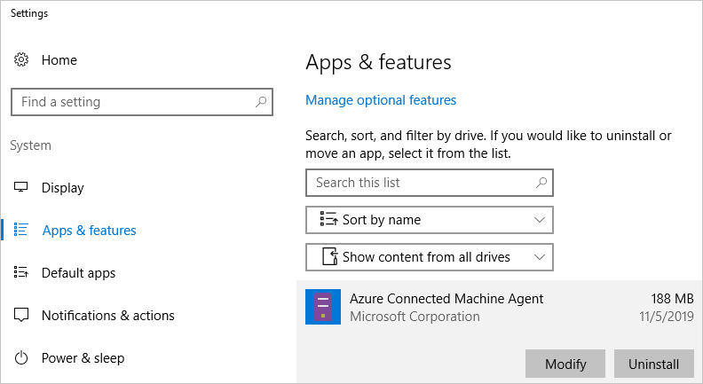

# Quickstart: Connect machines to Azure by using Azure Arc for servers

If you don't have an Azure subscription, create a [free account](https://azure.microsoft.com/free/?WT.mc_id=A261C142F) before you begin.

## Prerequisites

Review the supported clients and required network configuration in the [Azure Arc for servers overview](overview.md).

## Generate an agent installation script by using the Azure portal

1. Sign in to the [Azure portal](https://aka.ms/hybridmachineportal).
1. Select **Add**.
1. Follow the wizard to completion.
1. The final page of the wizard displays an installation script, which you can copy or download.

The script must be run on the target machine that you want to connect. The script downloads the agent, installs it, and connects the machine as a single operation.

On the non-Azure servers that you want to manage, do the following:

1. Log in to the server by using Secure Shell (SSH), the Remote Desktop Protocol (RDP), or PowerShell remoting.
1. Start a shell by running either of the following:
   * **On Windows**, run PowerShell as administrator.
   * **On Linux**, run Bash.
1. In the shell, paste the script that you copied from the portal, and run it on the server to connect to Azure.

   The default authentication for onboarding an individual server is *interactive* using Azure "device login." When you run the script, you'll see a message similar to:

   "To sign in, use a web browser to open the page `https://microsoft.com/devicelogin` and enter the code B3V3NLWRF to authenticate."
  
1. Open a browser, and enter the code to authenticate. The browser doesn't need to be running on the server that you're onboarding. It could be on another computer, such as your laptop.

1. If you want to authenticate non-interactively, follow the instructions in [Create a Service Principal](quickstart-onboard-powershell.md#create-a-service-principal-for-onboarding-at-scale), and modify the script that's generated from the portal.

> [!NOTE]
> If you're using Internet Explorer to log in to the server for the first time, you should receive an error. If you do, reopen the browser and log in again.

## Run the script on target nodes

Log in to each node, and run the script that you generated from the Azure portal. After the script has run successfully, go to the Azure portal to verify that the server has been successfully connected.


## Clean up

To disconnect a machine from Azure Arc for servers, do the following:

1. In the [Azure portal](https://aka.ms/hybridmachineportal), select the machine, select the ellipsis (**...**), and then select **Delete**.
1. Uninstall the agent from the machine by doing either of the following:

   * **On Windows**, go to the **Settings** > **Apps & features** pane to uninstall the agent.
  
     

     If you want to script the uninstallation, you can use the following example, which retrieves the *PackageId*, and then uninstall the agent by using `msiexec /X`.

     In the registry, under registry key `HKEY_LOCAL_MACHINE\Software\Microsoft\Windows\CurrentVersion\Uninstall`, look for *PackageId*. You can then uninstall the agent by using `msiexec`.

     The following example demonstrates how to uninstall the agent:

      ```powershell
      Get-ChildItem -Path HKLM:\Software\Microsoft\Windows\CurrentVersion\Uninstall | `
      Get-ItemProperty | `
      Where-Object {$_.DisplayName -eq "Azure Connected Machine Agent"} | `
      ForEach-Object {MsiExec.exe /Quiet /X "$($_.PsChildName)"}
      ```

   * **On Linux**, uninstall the agent by running the following command:

      ```bash
      sudo apt purge hybridagent
      ```

## Next steps

> [!div class="nextstepaction"]
> [Assign a policy to connected machines](../../governance/policy/assign-policy-portal.md)
