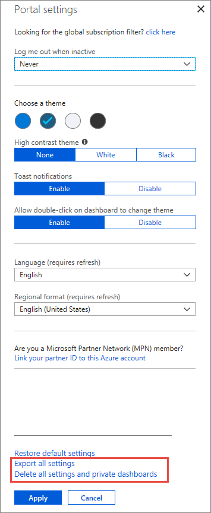

# Export or delete user settings

You can use settings and features in the Azure portal to create a custom experience. Information about your custom settings is stored in Azure. You can export or delete the following user data:

* Private dashboards in the Azure portal
* User settings like favorite subscriptions or directories, and last logged-in directory
* Themes and other custom portal settings

It's a good idea to export and review your settings before you delete them. Rebuilding dashboards or redoing custom settings can be time-consuming.

[!INCLUDE [GDPR-related guidance](../../includes/gdpr-intro-sentence.md)]

## Export or delete your portal settings

1. Sign in to the [Azure portal](https://portal.azure.com).
2. In the header of the portal, select **Settings**.

    

3. Select **Export all settings** or **Delete all settings and private dashboards**.

    

      The following table describes these actions.

      | Action | Description |
      | --- | --- |
      | **Export all settings** | Creates a .json file that contains your user settings like your color theme, favorites, and private dashboards.|
      | **Delete all settings and private dashboards** | Deletes all links to private dashboards and other custom settings you've made to the portal. |

> [!NOTE]
> The export and delete options for user settings are provided to help you comply with GDPR.  Due to the dynamic nature of user settings and risk of data corruption, you can't import settings from the .json file.
>
>

## Next steps

* - [Create and share Azure dashboards](azure-portal-dashboard-share-access.md)
- [Programmatically create Azure dashboards](../azure-portal-dashboards-create-programmatically.md)
