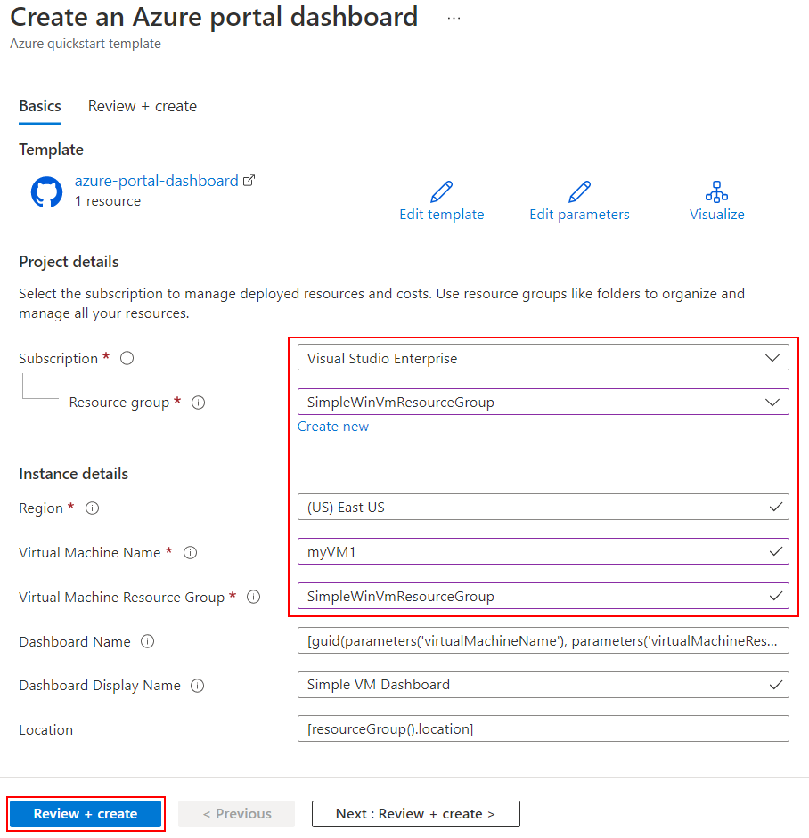
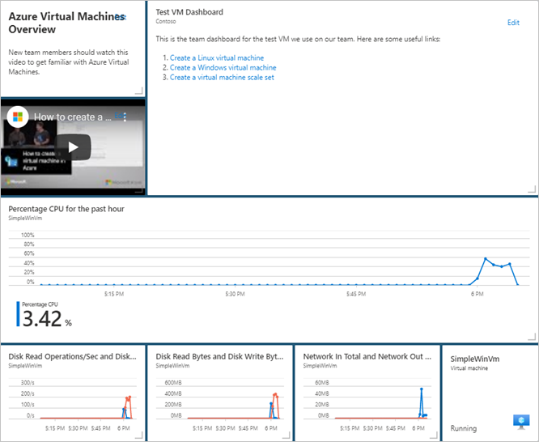

# Quickstart: Create a dashboard in the Azure portal by using an Azure Resource Manager template

A dashboard in the Azure portal is a focused and organized view of your cloud resources. This quickstart focuses on the process of deploying a Resource Manager template to create a dashboard. The dashboard shows the performance of a virtual machine (VM), as well as some static information and links.

[!INCLUDE [About Azure Resource Manager](../../includes/resource-manager-quickstart-introduction.md)]

If you don't have an Azure subscription, create a [free account](https://azure.microsoft.com/free/?WT.mc_id=A261C142F) before you begin.

## Create a virtual machine

The dashboard you create in the next part of this quickstart requires an existing VM. Create a VM by following these steps:

1. In the Azure portal, select Cloud Shell.

    

1. Copy the following command and enter it at the command prompt to create a resource group.

    ```powershell
    New-AzResourceGroup -Name SimpleWinVmResourceGroup -Location EastUS
    ```

    

1. Copy the following command and enter it at the command prompt to create a VM in the resource group.

    ```powershell
    New-AzVm `
        -ResourceGroupName "SimpleWinVmResourceGroup" `
        -Name "SimpleWinVm" `
        -Location "East US" 
    ```

1. Enter a username and password for the VM. This is a new user name and password; it's not, for example, the account you use to sign in to Azure. For more information, see [username requirements](../articles/virtual-machines/windows/faq.md#what-are-the-username-requirements-when-creating-a-vm) and [password requirements](../articles/virtual-machines/windows/faq.md#what-are-the-password-requirements-when-creating-a-vm).

    The VM deployment now starts and typically takes a few minutes to complete. After deployment completes, move on to the next section.

## Review the template

The template used in this quickstart is from [Azure Quickstart Templates](https://azure.microsoft.com/resources/templates/101-key-vault-create/). The template for this article is too long to show here. To view the template, see [azuredeploy.json](https://raw.githubusercontent.com/Azure/azure-quickstart-templates/master/101-key-vault-create/azuredeploy.json). One Azure resource is defined in the template, [Microsoft.Portal/dashboards](/azure/templates/microsoft.portal/dashboards) - Create a dashboard in the Azure portal.

## Deploy the template

1. Select the following image to sign in to Azure and open a template.

    [](https://portal.azure.com/#create/Microsoft.Template/uri/https%3A%2F%2Fraw.githubusercontent.com%2FAzure%2Fazure-quickstart-templates%2Fmaster%2F101-key-vault-create%2Fazuredeploy.json)

1. Select or enter the following values, then select **Review + create**.

    

    Unless it is specified, use the default values to create the dashboard.

    * **Subscription**: select an Azure subscription.
    * **Resource group**: select **SimpleWinVmResourceGroup**.
    * **Location**: select **East US**.
    * **Virtual Machine Name**: enter **SimpleWinVm**.
    * **Virtual Machine Resource Group**: enter **SimpleWinVmResourceGroup**.

1. Select **Create** or **Purchase**. After the dashboard has been deployed successfully, you get a notification:

    

The Azure portal was used to deploy the template. In addition to the Azure portal, you can also use Azure PowerShell, Azure CLI, and REST API. To learn other deployment methods, see [Deploy templates](../azure-resource-manager/templates/deploy-powershell.md).

## Review deployed resources

Check that the dashboard was created successfully and that you can see data from the VM.

1. In the Azure portal, select **Dashboard**.

    

1. On the dashboard page, select **Simple VM Dashboard**.

    

1. Review the dashboard that the ARM template created. You can see that some of the content is static, but there are also charts that show the performance of the VM you created at the beginning.

    

## Clean up resources

If you want to remove the VM and associated dashboard, delete the resource group that contains them.

1. In the Azure portal, search for **SimpleWinVmResourceGroup**, then select it in the search results.

1. On the **SimpleWinVmResourceGroup** page, select **Delete resource group**, enter the resource group name to confirm, then select **Delete**.

    

## Next steps

For more information about dashboards in the Azure portal, see:

> [!div class="nextstepaction"]
> [Create and share dashboards in the Azure portal](azure-portal-dashboards.md)