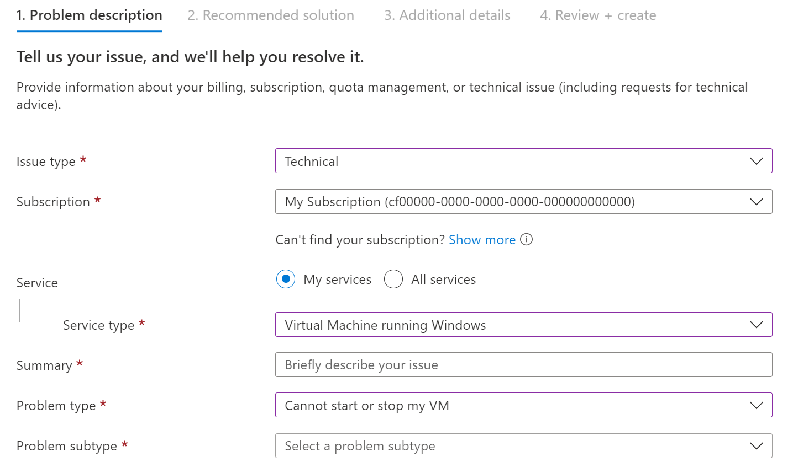

# Create an Azure support request

Azure enables you to create and manage support requests, also known as support tickets. You can create and manage requests in the [Azure portal](https://portal.azure.com), which is covered in this article. You can also create and manage requests programmatically, using the [Azure support ticket REST API](/rest/api/support).

> [!NOTE]
> The Azure portal URL is specific to the Azure cloud where your organization is deployed.
>
>* Azure portal for commercial use is: [https://portal.azure.com](https://portal.azure.com)
>* Azure portal for Germany is: [https://portal.microsoftazure.de](https://portal.microsoftazure.de)
>* Azure portal for the United States government is: [https://portal.azure.us](https://portal.azure.us)

The support request experience focuses on three main goals:

* **Streamlined**: Make support and troubleshooting easy to find and simplify how you submit a support request.
* **Integrated**: You can easily open a support request when you're troubleshooting an issue with an Azure resource, without switching context.
* **Efficient**: Gather the key information your support engineer needs to efficiently resolve your issue.

Azure provides unlimited support for subscription management, which includes billing, quota adjustments, and account transfers. For technical support, you need a support plan. For more information, see [Compare support plans](https://azure.microsoft.com/support/plans).

## Getting started

You can get to **Help + support** in the Azure portal. It's available from the Azure portal menu, the global header, or the resource menu for a service. Before you can file a support request, you must have appropriate permissions.

### Azure role-based access control

To create a support request, you must be an [Owner](../../role-based-access-control/built-in-roles.md#owner), [Contributor](../../role-based-access-control/built-in-roles.md#contributor) or be assigned to the [Support Request Contributor](../../role-based-access-control/built-in-roles.md#support-request-contributor) role at the subscription level. To create a support request without a subscription, for example an Azure Active Directory scenario, you must be an [Admin](../../active-directory/users-groups-roles/directory-assign-admin-roles.md).

### Go to Help + support from the global header

To start a support request from anywhere in the Azure portal:

1. Select the **?** in the global header. Then select **Help + support**.

   

1. Select **New support request**. Follow the prompts to provide information about your problem. We'll suggest some possible solutions, gather details about the issue, and help you submit and track the support request.

   

### Go to Help + support from a resource menu

To start a support request in the context of the resource, you're currently working with:

1. From the resource menu, in the **Support + Troubleshooting** section, select **New support request**.

   

1. Follow the prompts to provide us with information about the problem you're having. When you start the support request process from the resource, some options are pre-selected for you.

## Create a support request

We'll walk you through some steps to gather information about your problem and help you solve it. Each step is described in the following sections.

### Basics

The first step of the support request process gathers basic information about your issue and your support plan.

On the **Basics** tab of **New support request**, use the selectors to start to tell us about the problem. First, you'll identify some general categories for the issue type and choose the related subscription. Select the service, for example **Virtual Machine running Windows**. Select the resource, such as the name of your virtual machine. Describe the problem in your own words, then select **Problem type** and **Problem subtype** to get more specific.

### Solutions

After gathering basic information, we next show you solutions to try on your own. In some cases, we may even run a quick diagnostic. Solutions are written by Azure engineers and will solve most common problems.

### Details

Next, we collect additional details about the problem. Providing thorough and detailed information in this step helps us route your support request to the right engineer.

1. If possible, tell us when the problem started and any steps to reproduce it. You can upload a file, such as a log file or output from diagnostics. For more information on file uploads, see [File upload guidelines](how-to-manage-azure-support-request.md#file-upload-guidelines).

1. After we have all the information about the problem, choose how to get support. In the **Support method** section of **Details**, select the severity of impact. The maximum severity level depends on your [support plan](https://azure.microsoft.com/support/plans).

    By default the **Share diagnostic information** option is selected. This allows Azure support to gather [diagnostic information](https://azure.microsoft.com/support/legal/support-diagnostic-information-collection/) from your Azure resources. In some cases, there is a second question that isn't selected by default, such as requesting access to a virtual machine's memory.

1. Provide your preferred contact method, a good time to contact you, and your support language.

1. Next, complete the **Contact info** section so we know how to contact you.

### Review + create

Complete all required information on each tab, then select **Review + create**. Check the details that you'll send to support. Go back to any tab to make a change if needed. When you're satisfied the support request is complete, select **Create**.

A support engineer will contact you using the method you indicated. For information about initial response times, see [Support scope and responsiveness](https://azure.microsoft.com/support/plans/response/).

## Next steps

To learn more about self-help support options in Azure, watch this video:

> [!VIDEO https://www.youtube.com/embed/gNhzR5FE9DY]

Follow these links to learn more:

* [How to manage an Azure support request](how-to-manage-azure-support-request.md)
* [Azure support ticket REST API](/rest/api/support)
* [Send us your feedback and suggestions](https://feedback.azure.com/forums/266794-support-feedback)
* Engage with us on [Twitter](https://twitter.com/azuresupport)
* Get help from your peers in the [Microsoft Q&A question page](https://docs.microsoft.com/answers/products/azure)
* Learn more in [Azure Support FAQ](https://azure.microsoft.com/support/faq)
