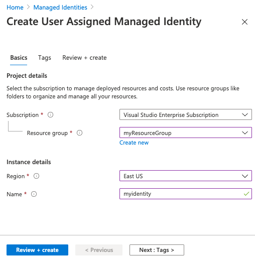
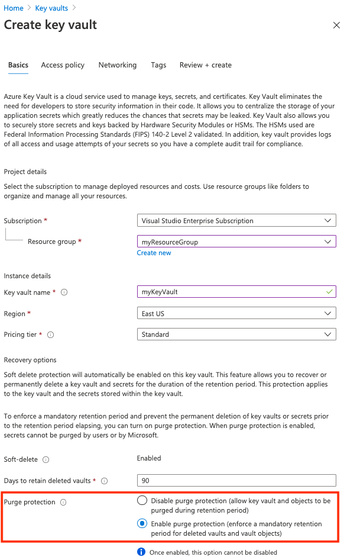
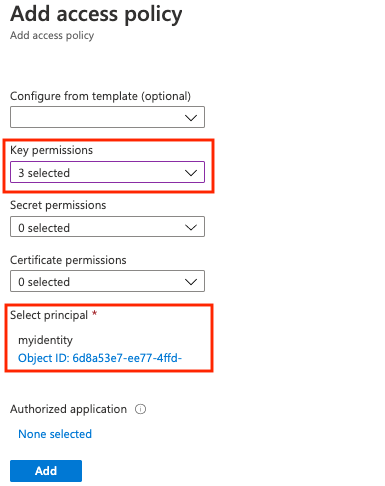
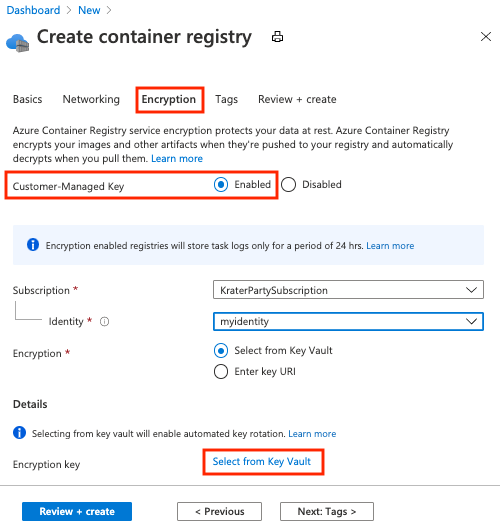

# Encryption using customer-managed keys

When you store images and other artifacts in an Azure container registry, Azure automatically encrypts the registry content at rest with [service-managed keys](../security/fundamentals/encryption-atrest.md#data-encryption-models). You can supplement default encryption with an additional encryption layer using a key that you create and manage in Azure Key Vault. This article walks you through the steps using the Azure CLI and the Azure portal.

Server-side encryption with customer-managed keys is supported through integration with [Azure Key Vault](../key-vault/key-vault-overview.md). You can create your own encryption keys and store them in a key vault, or you can use Azure Key Vault's APIs to generate encryption keys. With Azure Key Vault, you can also audit key usage.

This feature is available in the **Premium** container registry service tier. For information about registry service tiers and limits, see [Azure Container Registry SKUs](container-registry-skus.md).

> [!IMPORTANT]
> This feature is currently in preview, and some [limitations](#preview-limitations) apply. Previews are made available to you on the condition that you agree to the [supplemental terms of use][terms-of-use]. Some aspects of this feature may change prior to general availability (GA).
>
   
## Preview limitations 

* You can currently enable this feature only when you create a registry.
* After enabling a customer-managed key on a registry, you can't disable it.
* In a registry encrypted with a customer-managed key, run logs for [ACR Tasks](container-registry-tasks-overview.md) are currently retained for only 24 hours. If you need to retain logs for a longer period, see guidance to [export and save task run logs](container-registry-tasks-logs.md#alternative-storage-methods).

## Prerequisites

To use the Azure CLI steps in this article, you need Azure CLI version 2.2.0 or later. If you need to install or upgrade, see [Install Azure CLI](/cli/azure/install-azure-cli).

## Enable customer-managed key - CLI

### Create a resource group

If needed, run the [az group create][az-group-create] command to create a resource group for creating the key vault, container registry, and other required resources.

```azurecli
az group create --name <resource-group-name> --location <location>
```

### Create a user-assigned managed identity

Create a user-assigned [managed identity for Azure resources](../active-directory/managed-identities-azure-resources/overview.md) with the [az identity create][az-identity-create] command. This identity will be used by your registry to access the Key Vault service.

```azurecli
az identity create \
  --resource-group <resource-group-name> \
  --name <managed-identity-name> 
```

In the command output, take note of the following values: `id` and `principalId`. You need these values in later steps to configure registry access to the key vault.

```JSON
{
  "clientId": "xxxx2bac-xxxx-xxxx-xxxx-192cxxxx6273",
  "clientSecretUrl": "https://control-eastus.identity.azure.net/subscriptions/xxxxxxxx-xxxx-xxxx-xxxx-xxxxxxxxxxxx/resourcegroups/myresourcegroup/providers/Microsoft.ManagedIdentity/userAssignedIdentities/myidentityname/credentials?tid=xxxxxxxx-xxxx-xxxx-xxxx-xxxxxxxxxxxx&oid=xxxxxxxx-xxxx-xxxx-xxxx-xxxxxxxxxxxx&aid=xxxxxxxx-xxxx-xxxx-xxxx-xxxxxxxxxxxx",
  "id": "/subscriptions/xxxxxxxx-xxxx-xxxx-xxxx-xxxxxxxxxxxx/resourcegroups/myresourcegroup/providers/Microsoft.ManagedIdentity/userAssignedIdentities/myresourcegroup",
  "location": "eastus",
  "name": "myidentityname",
  "principalId": "xxxxxxxx-xxxx-xxxx-xxxx-xxxxxxxxxxxx",
  "resourceGroup": "myresourcegroup",
  "tags": {},
  "tenantId": "xxxxxxxx-xxxx-xxxx-xxxx-xxxxxxxxxxxx",
  "type": "Microsoft.ManagedIdentity/userAssignedIdentities"
}
```

For convenience, store these values in environment variables:

```azurecli
identityID=$(az identity show --resource-group <resource-group-name> --name <managed-identity-name> --query 'id' --output tsv)

identityPrincipalID=$(az identity show --resource-group <resource-group-name> --name <managed-identity-name> --query 'principalId' --output tsv)
```

### Create a key vault

Create a key vault with [az keyvault create][az-keyvault-create] to store a customer-managed key for registry encryption. 

To prevent data loss caused by accidental key or key vault deletions, you must enable the following settings: **Soft delete** and **Purge protection**. The following example includes parameters for these settings: 

```azurecli
az keyvault create --name <key-vault-name> \
  --resource-group <resource-group-name> \
  --enable-soft-delete \
  --enable-purge-protection
```

### Add key vault access policy

Configure a policy for the key vault so that the identity can access it. In the following [az keyvault set-policy][az-keyvault-set-policy] command, you pass the principal ID of the managed identity that you created, stored previously in an environment variable. Set key permissions to **get**, **unwrapKey**, and **wrapKey**.  

```azurecli
az keyvault set-policy \
  --resource-group <resource-group-name> \
  --name <key-vault-name> \
  --object-id $identityPrincipalID \
  --key-permissions get unwrapKey wrapKey 
```

### Create key and get key ID

Run the [az keyvault key create][az-keyvault-key-create] command to create a key in the key vault.

```azurecli
az keyvault key create \
  --name <key-name> \
  --vault-name <key-vault-name>
```

In the command output, take note of the key's ID, `kid`. You use this ID in the next step:

```JSON
[...]
  "key": {
    "crv": null,
    "d": null,
    "dp": null,
    "dq": null,
    "e": "AQAB",
    "k": null,
    "keyOps": [
      "encrypt",
      "decrypt",
      "sign",
      "verify",
      "wrapKey",
      "unwrapKey"
    ],
    "kid": "https://mykeyvault.vault.azure.net/keys/mykey/xxxxxxxxxxxxxxxxxxxxxxxx",
    "kty": "RSA",
[...]
```
For convenience, store this value in an environment variable:

```azurecli
keyID=$(az keyvault key show --name <keyname> --vault-name <key-vault-name> --query 'key.kid' --output tsv)
```

### Create a registry with customer-managed key

Run the [az acr create][az-acr-create] command to create a registry and enable the customer-managed key. Pass the managed identity principal ID and the key ID, stored previously in environment variables:

```azurecli
az acr create \
  --resource-group <resource-group-name> \
  --name <container-registry-name> \
  --identity $identityID \
  --key-encryption-key $keyID \
  --sku Premium
```

### Show encryption status

To show whether registry encryption with a customer-managed key is enabled, run the [az acr encryption show][az-acr-encryption-show] command:

```azurecli
az acr encryption show --name <registry-name> 
```

## Enable customer-managed key - portal

### Create a managed identity

Create a user-assigned [managed identity for Azure resources](../active-directory/managed-identities-azure-resources/overview.md) in the Azure portal. For steps, see [Create a user-assigned identity](../active-directory/managed-identities-azure-resources/how-to-manage-ua-identity-portal.md#create-a-user-assigned-managed-identity).

Take note of the **Resource Name** of the managed identity. You need this name in later steps.



### Create a key vault

For steps to create a key vault, see [Quickstart: Set and retrieve a secret from Azure Key Vault using the Azure portal](../key-vault/quick-create-portal.md).

When creating a key vault for a customer-managed key, in the **Basics** tab, you must enable the following protection settings: **Soft delete** and **Purge protection**. These settings help prevent data loss caused by accidental key or key vault deletions.



### Add key vault access policy

Configure a policy for the key vault so that the identity can access it.

1. Navigate to your key vault.
1. Select **Settings** > **Access policies > +Add Access Policy**.
1. Select **Key permissions**, and select **Get**, **Unwrap Key**, and **Wrap Key**.
1. Select **Select principal** and select the resource name of your user-assigned managed identity.  
1. Select **Add**, then select **Save**.



### Create key

1. Navigate to your key vault.
1. Select **Settings** > **Keys**.
1. Select **+Generate/Import** and enter a unique name for the key.
1. Accept the remaining default values and select **Create**.
1. After creation, select the key and take note of the current key version.

### Create Azure container registry

1. Select **Create a resource** > **Containers** > **Container Registry**.
1. In the **Basics** tab, select or create a resource group, and enter a registry name. In **SKU**, select **Premium**.
1. In the **Encryption** tab, in **Customer-managed key**, select **Enabled**.
1. In **Identity**, select the managed identity you created.
1. In **Encryption key**, select **Select from Key Vault**.
1. In the **Select key from Azure Key Vault** window, select the key vault, key, and version you created in the preceding section.
1. In the **Encryption** tab, select **Review + create**.
1. Select **Create** to deploy the registry instance.



To see the encryption status of your registry in the portal, navigate to your registry. Under **Settings**, select  **Encryption (Preview)**.

## Enable customer-managed key - template

You can also use a Resource Manager template to create a registry and enable encryption with a customer-managed key. 

The following template creates a new container registry and a user-assigned managed identity. Copy the following contents to a new file and save it using a filename such as `CMKtemplate.json`.

```JSON
{
  "$schema": "https://schema.management.azure.com/schemas/2015-01-01/deploymentTemplate.json#",
  "contentVersion": "1.0.0.0",
  "parameters": {
    "vault_name": {
      "defaultValue": "",
      "type": "String"
    },
    "registry_name": {
      "defaultValue": "",
      "type": "String"
    },
    "identity_name": {
      "defaultValue": "",
      "type": "String"
    },
    "kek_id": {
      "type": "String"
    }
  },
  "variables": {},
  "resources": [
    {
      "type": "Microsoft.ContainerRegistry/registries",
      "apiVersion": "2019-12-01-preview",
      "name": "[parameters('registry_name')]",
      "location": "[resourceGroup().location]",
      "sku": {
        "name": "Premium",
        "tier": "Premium"
      },
      "identity": {
        "type": "UserAssigned",
        "userAssignedIdentities": {
          "[resourceID('Microsoft.ManagedIdentity/userAssignedIdentities', parameters('identity_name'))]": {}
        }
      },
      "dependsOn": [
        "[resourceId('Microsoft.ManagedIdentity/userAssignedIdentities', parameters('identity_name'))]"
      ],
      "properties": {
        "adminUserEnabled": false,
        "encryption": {
          "status": "enabled",
          "keyVaultProperties": {
            "identity": "[reference(resourceId('Microsoft.ManagedIdentity/userAssignedIdentities', parameters('identity_name')), '2018-11-30').clientId]",
            "KeyIdentifier": "[parameters('kek_id')]"
          }
        },
        "networkRuleSet": {
          "defaultAction": "Allow",
          "virtualNetworkRules": [],
          "ipRules": []
        },
        "policies": {
          "quarantinePolicy": {
            "status": "disabled"
          },
          "trustPolicy": {
            "type": "Notary",
            "status": "disabled"
          },
          "retentionPolicy": {
            "days": 7,
            "status": "disabled"
          }
        }
      }
    },
    {
      "type": "Microsoft.KeyVault/vaults/accessPolicies",
      "apiVersion": "2018-02-14",
      "name": "[concat(parameters('vault_name'), '/add')]",
      "dependsOn": [
        "[resourceId('Microsoft.ManagedIdentity/userAssignedIdentities', parameters('identity_name'))]"
      ],
      "properties": {
        "accessPolicies": [
          {
            "tenantId": "[subscription().tenantId]",
            "objectId": "[reference(resourceId('Microsoft.ManagedIdentity/userAssignedIdentities', parameters('identity_name')), '2018-11-30').principalId]",
            "permissions": {
              "keys": [
                "get",
                "unwrapKey",
                "wrapKey"
              ]
            }
          }
        ]
      }
    },
    {
      "type": "Microsoft.ManagedIdentity/userAssignedIdentities",
      "apiVersion": "2018-11-30",
      "name": "[parameters('identity_name')]",
      "location": "[resourceGroup().location]"
    }
  ]
}

```

Follow the steps in the previous sections to create the following resources:

* Key vault, identified by name
* Key vault key, identified by key ID

Run the following [az group deployment create][az-group-deployment-create] command to create the registry using the preceding template file. Where indicated, provide a new registry name and managed identity name, as well as the key vault name and key ID you created. 

```bash
az group deployment create \
  --resource-group <resource-group-name> \
  --template-file CMKtemplate.json \
  --parameters \
    registry_name=<registry-name> \
    identity_name=<managed-identity> \
    vault_name=<key-vault-name> \
    kek_id=<key-vault-key-id>
```

### Show encryption status

To show the status of registry encryption, run the [az acr encryption show-status][az-acr-encryption-show-status] command:

```azurecli
az acr encryption show-status --name <registry-name> 
```

## Use the registry

After you enable a registry to encrypt data using a customer-managed key, you can perform the same registry operations that you perform in a registry that's not encrypted with a customer-managed key. For example, you can authenticate with the registry and push Docker images. See example commands in [Push and pull an image](container-registry-get-started-docker-cli.md).

## Rotate key

You can rotate a customer-managed key in Azure Key Vault according to your compliance policies. Create a new key, and then update the registry to encrypt data using the new key. You can perform these steps using the Azure CLI or in the portal.

For example, run the [az keyvault key create][az-keyvault-key-create] command to create a new key:

```azurecli
az keyvault key create –-name <new-key-name> --vault-name <key-vault-name> 
```

Then run the [az acr encryption rotate-key][az-acr-encryption-rotate-key] command, passing the new key ID and the principal ID of the managed identity you previously configured:

```azurecli
az acr encryption rotatekey \
  --name <registry-name> \
  --key-encryption-key <new-key-id> \
  --identity $identityPrincipalID
```

## Revoke key

Revoke the customer-managed encryption key by changing the access policy on the key vault or by deleting the key. For example, use the [az keyvault delete-policy][az-keyvault-delete-policy] command to change the access policy of the managed identity used by your registry. For example:

```azurecli
az keyvault delete-policy \
  --resource-group <resource-group-name> \
  --name <key-vault-name> \
  --object-id $identityPrincipalID
```

Revoking the key effectively blocks access to all registry data, since the registry can't access the encryption key. If access to the key is enabled or the deleted key is restored, your registry will pick the key so you can again access the encrypted registry data.

## Next steps

* Learn more about [encryption at rest in Azure](../security/fundamentals/encryption-atrest.md)
* Learn more about access policies and how to [secure access to a key vault](../key-vault/key-vault-secure-your-key-vault.md).
* To provide feedback on customer-managed keys for Azure Container Registry, visit the [ACR GitHub site](https://aka.ms/acr/issues)


<!-- LINKS - external -->
[terms-of-use]: https://azure.microsoft.com/support/legal/preview-supplemental-terms

<!-- LINKS - internal -->

[az-feature-register]: /cli/azure/feature#az-feature-register
[az-feature-show]: /cli/azure/feature#az-feature-show
[az-group-create]: /cli/azure/group#az-group-create
[az-identity-create]: /cli/azure/identity#az-identity-create
[az-feature-register]: /cli/azure/feature#az-feature-register
[az-group-deployment-create]: /cli/azure/group/deployment#az-group-deployment-create
[az-keyvault-create]: /cli/azure/keyvault#az-keyvault-create
[az-keyvault-key-create]: /cli/azure/keyvault/keyt#az-keyvault-key-create
[az-keyvault-set-policy]: /cli/azure/keyvault/keyt#az-keyvault-set-policy
[az-keyvault-delete-policy]: /cli/azure/keyvault/keyt#az-keyvault-delete-policy
[az-resource-show]: /cli/azure/resource#az-resource-show
[az-acr-create]: /cli/azure/acr#az-acr-create
[az-acr-show]: /cli/azure/acr#az-acr-show
[az-acr-encryption-rotate-key]: /cli/azure/acr/encryption#az-acr-encryption-rotate-key
[az-acr-encryption-show]: /cli/azure/acr/encryption#az-acr-encryption-show