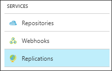
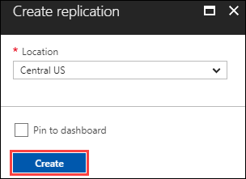

# Geo-replication in Azure Container Registry

Companies that want a local presence, or a hot backup, choose to run services from multiple Azure regions. As a best practice, placing a container registry in each region where images are run allows network-close operations, enabling fast, reliable image layer transfers.

Geo-replication enables an Azure container registry to function as a single registry, serving multiple regions with multi-master regional registries.

> [!IMPORTANT]
> The geo-replication feature of Azure Container Registry is currently in **preview**. Previews are made available to you on the condition that you agree to the  [supplemental terms of use](https://azure.microsoft.com/support/legal/preview-supplemental-terms/). Some aspects of this feature may change prior to general availability (GA).
>

A geo-replicated registry provides the following benefits:

* Single registry/image/tag names can be used across multiple regions
* Network-close registry access from regional deployments
* No additional egress fees, as images are pulled from a local, replicated registry in the same region as your container host
* Single management of a registry across multiple regions

## Example use case
Contoso runs a public presence website located across the US, Canada, and Europe. To serve these markets with local and network-close content, Contoso runs [Azure Container Service](/azure/container-service/kubernetes/) (ACS) Kubernetes clusters in West US, East US, Canada Central, and West Europe. The website application, deployed as a Docker image, utilizes the same code and image across all regions. Content, local to that region, is retrieved from a database, which is provisioned uniquely in each region. Each regional deployment has its unique configuration for resources like the local database.

The development team is located in Seattle WA, utilizing the West US data center.

<br />*Pushing to multiple registries*

Prior to using the geo-replication features, Contoso had a US-based registry in West US, with an additional registry in West Europe. To serve these different regions, the development team had to push images to two different registries.

```bash
docker push contoso.azurecr.io/pubic/products/web:1.2
docker push contosowesteu.azurecr.io/pubic/products/web:1.2
```
<br />*Pulling from multiple registries*

Typical challenges of multiple registries include:

* The East US, West US, and Canada Central clusters all pull from the West US registry, incurring egress fees as each of these remote container hosts pull images from West US data centers.
* The development team must push images to West US and West Europe registries.
* The development team must configure and maintain each regional deployment with image names referencing the local registry.
* Registry access must be configured for each region.

## Benefits of geo-replication


Using the geo-replication feature of Azure Container Registry, these benefits are realized:

* Manage a single registry across all regions: `contoso.azurecr.io`
* Manage a single configuration of image deployments as all regions used the same image URL: `contoso.azurecr.io/public/products/web:1.2`
* Push to a single registry, while ACR manages the geo-replication, including regional webhooks for local notifications

## Configure geo-replication
Configuring geo-replication is as easy as clicking regions on a map.

Geo-replication is a feature of [Premium registries](container-registry-skus.md) only. If your registry isn't yet Premium, you can change from Basic and Standard to Premium with the following [Azure CLI](/cli/azure/install-azure-cli) command:

```azurecli-interactive
az acr update -n myregistry --sku Premium
```

You can also switch to Premium in the [Azure portal](https://portal.azure.com):


>

To configure geo-replication for your Premium registry, log in to the Azure portal at http://portal.azure.com.

Navigate to your Azure Container Registry, and select **Replications**:



A map is displayed showing all current Azure Regions:

 

* Blue hexagons represent current replicas
* Green hexagons represent possible replica regions
* Gray hexagons represent Azure regions not yet available for replication

To configure a replica, select a green hexagon, then select **Create**:

 

To configure additional replicas, select the green hexagons for other regions, then click **Create**.

ACR begins syncing images across the configured replicas. Once complete, the portal reflects *Ready*. The replica status in the portal doesn't automatically update. Use the refresh button to see the updated status.

## Geo-replication pricing

Geo-replication is a feature of the [Premium SKU](container-registry-skus.md#premium) of Azure Container Registry. When you replicate a registry to your desired regions, you incur Premium registry fees for each region.

In the preceding example, Contoso consolidated two registries down to one, adding replicas to East US, Canada Central, and West Europe. Contoso would pay four times Premium per month, with no additional configuration or management. Each region now pulls their images locally, improving performance, reliability without network egress fees from West US to Canada and East US.

## Summary

With geo-replication, you can manage your regional data centers as one global cloud. As images are used across many Azure services, you can benefit from a single management plane while maintaining network-close, fast, and reliable local image pulls.
