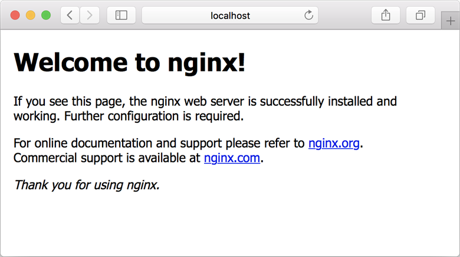

# Push your first image to a private Docker container registry using the Docker CLI

An Azure container registry stores and manages private [Docker](http://hub.docker.com) container images, similar to the way [Docker Hub](https://hub.docker.com/) stores public Docker images. You can use the [Docker command-line interface](https://docs.docker.com/engine/reference/commandline/cli/) (Docker CLI) for [login](https://docs.docker.com/engine/reference/commandline/login/), [push](https://docs.docker.com/engine/reference/commandline/push/), [pull](https://docs.docker.com/engine/reference/commandline/pull/), and other operations on your container registry.

In the following steps, you download an official [Nginx image](https://store.docker.com/images/nginx) from the public Docker Hub registry, tag it for your private Azure container registry, push it to your registry, and then pull it from the registry.

## Prerequisites

* **Azure container registry** - Create a container registry in your Azure subscription. For example, use the [Azure portal](container-registry-get-started-portal.md) or the [Azure CLI 2.0](container-registry-get-started-azure-cli.md).
* **Docker CLI** - To set up your local computer as a Docker host and access the Docker CLI commands, install [Docker](https://docs.docker.com/engine/installation/).

## Log in to a registry

There are [several ways to authenticate](container-registry-authentication.md) to your private container registry. The recommended method when working in a command line is with the Azure CLI command [az acr login](/cli/azure/acr?view=azure-cli-latest#az_acr_login):

```azurecli
az acr login --name <acrName>
```

You can also log in with [docker login](https://docs.docker.com/engine/reference/commandline/login/). The following example passes the ID and password of an Azure Active Directory [service principal](../active-directory/active-directory-application-objects.md). For example, you might have [assigned a service principal](container-registry-authentication.md#service-principal) to your registry for an automation scenario.

```Bash
docker login myregistry.azurecr.io -u xxxxxxxx-xxxx-xxxx-xxxx-xxxxxxxxxxxx -p myPassword
```

Both commands returns `Login Succeeded` once completed. If you use `docker login`, you might also see a security warning recommending the use of the `--password-stdin` parameter. While its use is outside the scope of this article, we recommend following this best practice. For more information, see the [docker login](https://docs.docker.com/engine/reference/commandline/login/) command reference.

> [!TIP]
> Always specify the fully qualified registry name (all lowercase) when you use `docker login` and when you tag your images. In the examples in this article, the fully qualified name is *myregistry.azurecr.io*.

## Pull the official Nginx image

First, pull the public Nginx image to your local computer.

```Bash
docker pull nginx
```

## Run the container locally

Execute following [docker run](https://docs.docker.com/engine/reference/run/) command to start a local instance of the Nginx container interactively (`-it`) on port 8080. The `--rm` argument specifies that the container should be removed when you stop it.

```Bash
docker run -it --rm -p 8080:80 nginx
```

Browse to [http://localhost:8080](http://localhost:8080) to view default web page served by Nginx in the running in the container. You should see a page similar to the following:



Because you started the container interactively with `-it`, you can see the Nginx server's output on the command line.

To stop the container, press `Control`+`C`.

## Create an alias of the image

Use [docker tag](https://docs.docker.com/engine/reference/commandline/tag/) to create an alias of the image with the fully qualified path to your registry. This example specifies the `samples` namespace to avoid clutter in the root of the registry.

```Bash
docker tag nginx myregistry.azurecr.io/samples/nginx
```

## Push the image to your registry

Now that you've tagged the image with the fully qualified path to your private registry, you can push it to the registry with [docker push](https://docs.docker.com/engine/reference/commandline/push/):

```Bash
docker push myregistry.azurecr.io/samples/nginx
```

## Pull the image from your registry

Use the [docker pull](https://docs.docker.com/engine/reference/commandline/pull/) command to pull the image from your registry:

```Bash
docker pull myregistry.azurecr.io/samples/nginx
```

## Start the Nginx container

Use the [docker run](https://docs.docker.com/engine/reference/run/) command to run the image you've pulled from your registry:

```Bash
docker run -it --rm -p 8080:80 myregistry.azurecr.io/samples/nginx
```

Browse to [http://localhost:8080](http://localhost:8080) to view the running container.

To stop and remove the container, press `Control`+`C`.

## Remove the image (optional)

If you no longer need the Nginx image in your registry, you can delete it with the [docker rmi](https://docs.docker.com/engine/reference/commandline/rmi/) command.

```Bash
docker rmi myregistry.azurecr.io/samples/nginx
```

You can also use the Azure CLI command [az acr repository delete](/cli/azure/acr/repository#az_acr_repository_delete) to remove images from your registry. For example, the following command deletes the manifest referenced by a tag. It also deletes any associated layer data and all other tags referencing the manifest.

```azurecli
az acr repository delete --name myregistry --repository samples/nginx --tag latest --manifest
```

## Next steps

Now that you know the basics, you're ready to start using your registry! For example, deploy container images from your registry to an [Azure Container Service (AKS)](../aks/tutorial-kubernetes-prepare-app.md) cluster.
