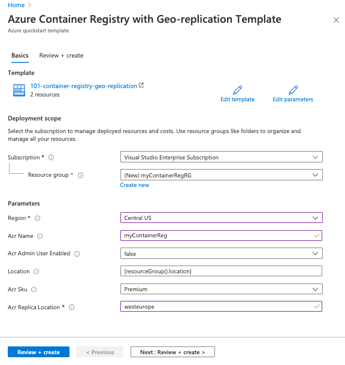
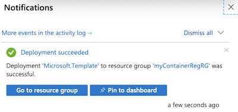
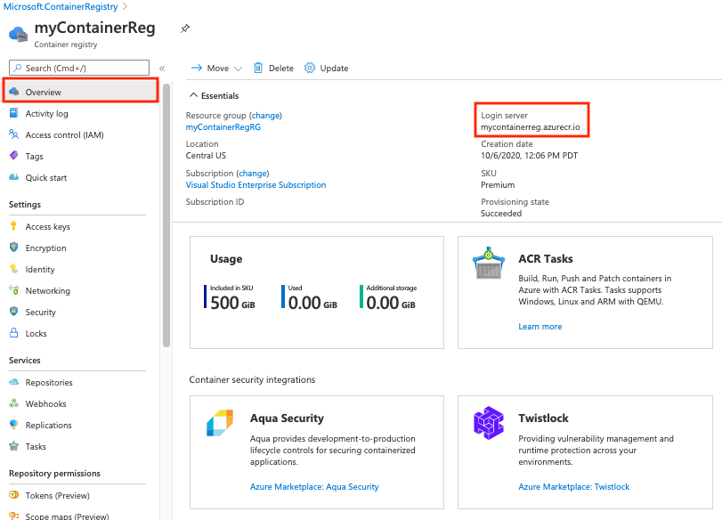
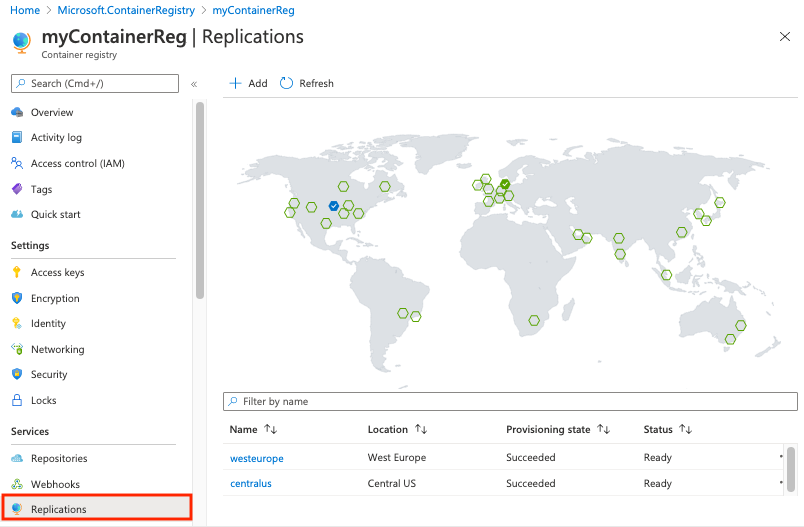

# Quickstart: Create a geo-replicated container registry by using a Resource Manager template

Azure Container Registry is a managed Docker container registry service used for storing private Docker container images and related artifacts. This quickstart shows how to create an Azure Container Registry instance using an Azure Resource Manager template. 

The template sets up a [geo-replicated](container-registry-geo-replication.md) registry, which automatically synchronizes registry content across more than one Azure region. Geo-replication enables network-close access to images from regional deployments, while providing a single management experience. It's a feature of the [Premium](container-registry-skus.md) registry service tier and 

[!INCLUDE [About Azure Resource Manager](../../includes/resource-manager-quickstart-introduction.md)]

If you don't have an Azure subscription, create a [free](https://azure.microsoft.com/free/) account before you begin.

## Prerequisites

None.

## Create a geo-replicated registry

### Review the template

The template used in this quickstart is from [Azure Quickstart templates](https://github.com/Azure/azure-quickstart-templates/tree/master/101-container-registry-geo-replication).

[!code-json[<Azure Resource Manager template create geo-replicated registry>](~/quickstart-templates/101-container-registry-geo-replication/azuredeploy.json)]

The following resources are defined in the template:

* **[Microsoft.ContainerRegistry/registries](/azure/templates/microsoft.containerregistry/registries)**: create an Azure container registry
* **[Microsoft.ContainerRegistry/registries/replications](/azure/templates/microsoft.containerregistry/registries/replications)**: create a container registry replica

More Azure Container Registry template samples can be found in the [quickstart template gallery](https://azure.microsoft.com/resources/templates/?resourceType=Microsoft.Containerregistry&pageNumber=1&sort=Popular).

### Deploy the template

 1. Select the following image to sign in to Azure and open a template. The template creates a registry and a replica in another location.

    

 2. Select or enter the following values.

    * **Subscription**: select an Azure subscription.
    * **Resource group**: select **Create new**, enter a unique name for the resource group, and then select **OK**.
    * **Location**: select a location for the resource group. Example: **Central US**.
    * **Acr Name**: accept the generated name for the registry, or enter a name. It must be globally unique.
    * **Location**: accept the generated location for the registry's home replica, or enter a location such as **Central US**. 
    * **Acr Replica Location**: enter a location for the registry replica, using the region's short name. It must be different from the home registry location. Example: **westeurope**.
    * **I agree to the terms and conditions stated above**: Select.

      

 3. If you accept the terms and conditions, select **Purchase**. After the registry has been created successfully, you get a notification:

    

 The Azure portal is used to deploy the template. In addition to the Azure portal, you can use the Azure PowerShell, Azure CLI, and REST API. To learn other deployment methods, see [Deploy templates](../azure-resource-manager/templates/deploy-cli.md).

## Review deployed resources

Use the Azure portal or a tool such as the Azure CLI to review the properties of the container registry.

1. In the portal, search for Container Registries, and select the container registry you created.

1. On the **Overview** page, note the **Login server** of the registry. Use this URI when you use Docker to tag and push images to your registry. For information, see [Push your first image using the Docker CLI](container-registry-get-started-docker-cli.md).
    

1. On the **Replications** page, confirm the locations of the home replica and the replica added through the template. If desired, add more replicas on this page.

  

## Clean up resources

When you no longer need them, delete the resource group, the registry, and the registry replica. To do so, go to the Azure portal, select the resource group that contains the registry, and then select **Delete resource group**.

## Next steps

In this quickstart, you created an Azure Container Registry with a Resource Manager template, and configured a registry replica in another location. Continue to the Azure Container Registry tutorials for a deeper look at ACR.

> [!div class="nextstepaction"]
> [Azure Container Registry tutorials](container-registry-tutorial-prepare-registry.md)

For a step-by-step tutorial that guides you through the process of creating a template, see:

> [!div class="nextstepaction"]
> [Tutorial: Create and deploy your first Azure Resource Manager template](/azure/azure-resource-manager/templates/template-tutorial-create-first-template.md)