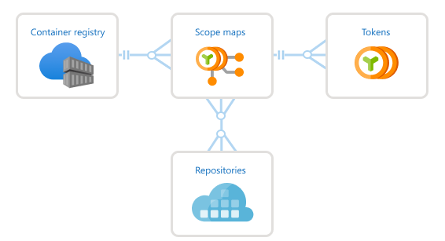
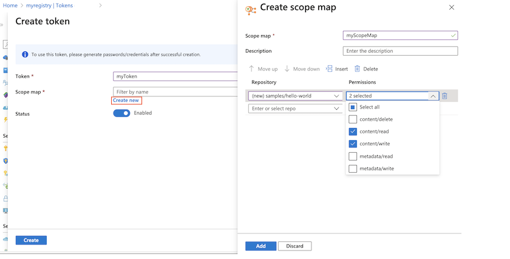
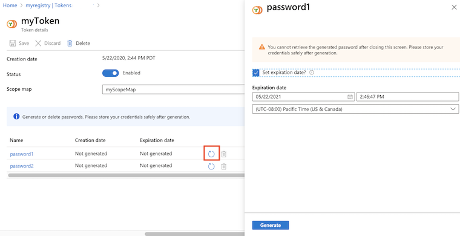

# Create an access token with repository-scoped permissions

This article shows how to create an access token that allows actions on only specific repositories in a registry. With an access token, a registry owner can provide users or services with scoped, time-limited access to repositories to pull or push images or perform other actions. An access token provides more fine-grained permissions than other registry [authentication options](container-registry-authentication.md), which scope permissions to an entire registry. 

Scenarios for creating an access token include:

* Allow IoT devices with individual tokens to pull an image from a repository
* Provide an external organization with permissions to a specific repository 
* Limit repository access to different user groups in your organization. For example, provide write and read access to developers who build images that target specific repositories, and read access to teams that deploy from those repositories.

> [!IMPORTANT]
> This feature is currently in preview, and some [limitations apply](#preview-limitations). Previews are made available to you on the condition that you agree to the [supplemental terms of use][terms-of-use]. Some aspects of this feature may change prior to general availability (GA).

## Preview limitations

* This feature is only available in a **Premium** container registry. For information about registry service tiers and limits, see [Azure Container Registry SKUs](container-registry-skus.md).
* You can't currently assign repository-scoped permissions to an Azure Active Directory identity, such as a service principal or managed identity.

## Concepts

To configure repository-scoped permissions, you create an *access token* and an associated *scope map*. 

* An **access token** with a generated password provides credentials to authenticate with the registry. Associated with each token are permitted *actions* you scope to one or more repositories - for example, to read repository data to allow pulling images. 

  After authenticating with a token, a user or system can then perform the actions on the repository. You can set an expiration time for a token password, or disable a token at any time. 

* **Actions** on a specified repository include one or more of the following.

  |Action  |Description  | Example |
  |---------|---------|--------|
  |`content/read`     |  Read data from the repository |  Pull an artifact |
  |`metadata/read`    | Read metadata from the repository   | List tags or show manifest metadata |
  |`content/write`     |  Write data to the repository     | Use with `content/read` to push an artifact |
  |`metadata/write`     |  Write metadata to the repository  | Update manifest attributes |
  |`content/delete`    | Remove data from the repository  | Delete a repository or a manifest |

* A **scope map** groups repository permissions you apply to a token, or can reapply to other tokens. A scope map helps you configure multiple users with identical access to a set of repositories. Azure Container Registry also provides several system-defined scope maps that you can apply when creating access tokens.

The following image shows the relationship between tokens and scope maps. 



## Prerequisites

* **Azure CLI** - Azure CLI commands to create and manage access tokens are available in Azure CLI version 2.0.76 or later. Run `az --version` to find the version. If you need to install or upgrade, see [Install Azure CLI](/cli/azure/install-azure-cli).
* **Docker** - To authenticate with the registry to pull or push images, you need a local Docker installation. Docker provides installation instructions for [macOS](https://docs.docker.com/docker-for-mac/), [Windows](https://docs.docker.com/docker-for-windows/), and [Linux](https://docs.docker.com/engine/installation/#supported-platforms) systems.
* **Container registry** - If you don't have one, create a Premium container registry in your Azure subscription, or upgrade an existing registry. For example, use the [Azure portal](container-registry-get-started-portal.md) or the [Azure CLI](container-registry-get-started-azure-cli.md). 

## Create access token - CLI

### Create access token and specify repositories

Create a token using the [az acr token create][az-acr-token-create] command. When creating a token, you can specify one or more repositories and associated actions on each repository. The repositories don't need to be in the registry yet.

The following example creates an access token in the registry *myregistry* with the following permissions on the `samples/hello-world` repo: `content/write` and `content/read`. By default, the command sets the default token status to `enabled`, but you can update the status to `disabled` at any time.

```azurecli
az acr token create --name MyToken --registry myregistry \
  --repository samples/hello-world \
  content/write content/read
```

The output shows details about the token, including two generated password. It's recommended to save the passwords in a safe place to use later for authentication. The passwords can't be retrieved again but new ones can be generated.

```console
{
  "creationDate": "2020-01-18T00:15:34.066221+00:00",
  "credentials": {
    "certificates": [],
    "passwords": [
      {
        "creationTime": "2020-01-18T00:15:52.837651+00:00",
        "expiry": null,
        "name": "password1",
        "value": "uH54BxxxxK7KOxxxxRbr26dAs8JXxxxx"
      },
      {
        "creationTime": "2020-01-18T00:15:52.837651+00:00",
        "expiry": null,
        "name": "password2",
        "value": "kPX6Or/xxxxLXpqowxxxxkA0idwLtmxxxx"
      }
    ],
    "username": "MyToken"
  },
  "id": "/subscriptions/xxxxxxxx-adbd-4cb4-c864-xxxxxxxxxxxx/resourceGroups/myresourcegroup/providers/Microsoft.ContainerRegistry/registries/myregistry/tokens/MyToken",
  "name": "MyToken",
  "objectId": null,
  "provisioningState": "Succeeded",
  "resourceGroup": "myresourcegroup",
  "scopeMapId": "/subscriptions/xxxxxxxx-adbd-4cb4-c864-xxxxxxxxxxxx/resourceGroups/myresourcegroup/providers/Microsoft.ContainerRegistry/registries/myregistry/scopeMaps/MyToken-scope-map",
  "status": "enabled",
  "type": "Microsoft.ContainerRegistry/registries/tokens"
```

The output also include details about the scope map the command created. You can use the scope map, HERE named `MyToken-scope-map`, to apply the same repository actions to other tokens. Or, update the scope map later to change the token permissions.

### Create access token and specify scope map

An alternative way to create an access token is to specify an existing scope map. If you don't already have a scope map, first create a scope map by specifying repositories and associated actions. Then, specify the scope map when creating a token. 

To create a scope map, use the [az acr scope-map create][az-acr-scope-map-create] command. The following example command creates a scope map with the same permissions used in the previous example. 

```azurecli
az acr scope-map create --name MyScopeMap --registry myregistry \
  --repository samples/hello-world \
  content/write content/read \
  --description "Sample scope map"
```

Run [az acr token create][az-acr-token-create] to create a token, specifying the *MyScopeMap* scope map. By default, the command sets the default token status to `enabled`, but you can update the status to `disabled` at any time.

```azurecli
az acr token create --name MyToken \
  --registry myregistry \
  --scope-map MyScopeMap
```

The output shows details about the token, including two generated password. It's recommended to save the passwords in a safe place to use later for authentication. The passwords can't be retrieved again but new ones can be generated.

## Create access token - portal

You can create access tokens and scope maps using the Azure portal. As with the `az acr token create` CLI command, you can apply an existing scope map, or create a scope map by specifying one or more repositories and associated actions. The repositories don't need to be in the registry yet. 

The following example creates a token to access the `samples/hello-world` repository, and creates a scope map with the following permissions: `content/write` and `content/read`.

1. In the portal, navigate to your container registry.
1. Under **Services**, select **Tokens (Preview) > +Add**.
1. Enter a token name.
1. Under **Scope map**, select **Create new**.
   
1. Configure the scope map:
    1. Enter a name and description for the scope map. 
    1. Under **Repositories**, enter `samples/hello-world`, and under **Permissions**, select  `content/read` and `content/write`. Then select **+Add**.  
    

    1. After adding repositories and permissions, select **Add** to add the scope map.
1. Accept the default **Status** of **Enabled** and then select **Create**.

After the token is validated and created, token details appear in the **Tokens** screen.

### Add token password

Generate a password after you create a token. To authenticate with the registry, the token must be enabled and have a valid password.

You can generate one or two passwords, and set an expiration date for each one. 

1. In the portal, navigate to your container registry.
1. Under **Services**, select **Tokens (Preview)**, and select a token.
1. In the token details, select **password1** or **password2**, and select the Generate icon.
1. In the password screen, optionally set and expiration date and time for the password, and select **Generate**.
1. After generating a password, copy and save it to a safe location before closing the screen. You can't retrieve a generated password after closing the screen, but new ones can be generated.

    

## Authenticate with token

Provide a token name as a user name and one of its associated passwords for a user or system to authenticate with the target registry. The authentication method depends on the configured action or actions.

|Action  |How to authenticate  |
  |---------|---------|
  |`content/read`     |  `docker login`<br/><br/>`az acr login` in Azure CLI  |
  |`metadata/read`    | `az acr repository show`<br/><br/>`az acr repository show-tags`<br/><br/>`az acr repository show-manifests` in Azure CLI   |
  |`content/write`     |  `docker login`<br/><br/>`az acr login` in Azure CLI     |
  |`metadata/write`     |  `az acr repository untag`<br/><br/>`az acr repository update` in Azure CLI |
  |`content/delete`    | `az acr repository delete` in Azure CLI |

## Examples: Use token

The following examples use the token created earlier in this article to perform common operations on a repository: push and pull images, delete images, and so on. The token was set up initially with push permissions (`content/write` and `content/read` actions) on the `samples/hello-world` repository.

### Pull and tag test images

For the following examples, pull the `hello-world` and `alpine` images from Docker Hub, and tag them for your registry and repository.

```bash
docker pull hello-world
docker pull alpine
docker tag hello-world myregistry.azurecr.io/samples/hello-world:v1
docker tag hello-world myregistry.azurecr.io/alpine:v1
```

### Authenticate using token

Run `docker login` to authenticate with the registry, Provide the token name as the user name, and provide one of its passwords. The token must have the `Enabled` status.

The following example is formatted for the bash shell, and provides the values using environment variables.

```bash
TOKEN_NAME=MyToken
TOKEN_PWD=<token password>

echo $TOKEN_PWD | docker login --username $TOKEN_NAME --password-stdin myregistry.azurecr.io
```

Output should show successful authentication:

```console
Login Succeeded
```

### Push images to registry

After successful login, attempt to push the tagged images to the registry. Because the token has permissions to push images to the `samples/hello-world` repository, the following push succeeds:

```bash
docker push myregistry.azurecr.io/samples/hello-world:v1
```

The token doesn't have permissions to the `samples/alpine` repo, so the following push attempt fails with an error similar to `requested access to the resource is denied`:

```bash
docker push myregistry.azurecr.io/samples/alpine:v1
```

### Change push/pull permissions

To update the permissions of a token, update the permissions in the associated scope map. The updated scope map is applied to all associated tokens. 

For example, update `MyToken-scope-map` with `content/write` and `content/read` actions on the `samples/alpine` repository, and remove the `content/write` action on the `samples/hello-world` repository.  

If you use the Azure CLI, run [az acr scope-map update][az-acr-scope-map-update] to update the scope map:

```azurecli
az acr scope-map update \
  --name MyScopeMap \
  --registry myregistry \
  --add samples/alpine content/write content/read \
  --remove samples/hello-world content/write 
```

In the Azure portal:

1. Navigate to your container registry.
1. Under **Services**, select **Scope maps (Preview)**, and select the scope map to update update.
1. Under **Repositories**, enter `samples/alpine`, and under **Permissions**, select `content/read` and `content/write`. Then select **+Add**.
1. Under **Repositories**, select `samples/hello-world` and under **Permissions**, deselect `content/write`.

After updating the scope map, the following push succeeds:

```bash
docker push myregistry.azurecr.io/samples/alpine:v1
```

Because the scope map only has the `content/read` permission on the `samples/hello-world` repository, a push attempt to the `samples/hello-world` repo now fails:
 
```bash
docker push myregistry.azurecr.io/samples/hello-world:v1
```

Because the scope map provides `content/read` permissions on both repositories, pulling images from both repos succeeds:

```bash
docker pull myregistry.azurecr.io/samples/alpine:v1
docker pull myregistry.azurecr.io/samples/hello-world:v1
```
### Delete images

Update the scope map by adding the `content/delete` action to the `alpine` repository. This action allows deletion of images in the repository, or deletion of the entire repository.

For brevity, we show only the [az acr scope-map update][az-acr-scope-map-update] command to update the scope map:

```azurecli
az acr scope-map update \
  --name MyScopeMap \
  --registry myregistry \
  --add samples/alpine content/delete
``` 

For steps to update the scope map using the portal, see the preceding section.

Use the following [az acr repository delete][az-acr-repository-delete] command to delete the `samples/alpine` repository. Deletion doesn't use authentication through `docker login`. Instead, pass the token's name and password to the command. The following example uses the environment variables created earlier in the article:

```azurecli
az acr repository delete \
  --name myregistry --repository samples/alpine \
  --username $TOKEN_NAME --password $TOKEN_PWD
```

### Show repo tags 

Update the scope map by adding the `metadata/read` action to the `hello-world` repository. This action allows showing manifest and tag data in the repository.

For brevity, we show only the [az acr scope-map update][az-acr-scope-map-update] command to update the scope map:

```azurecli
az acr scope-map update \
  --name MyScopeMap \
  --registry myregistry \
  --add samples/hello-world metadata/read 
```  

For steps to update the scope map using the portal, see the preceding section.

To read metadata in the `samples/hello-world` repository, run the [az acr repository show-manifests][az-acr-repository-show-manifests] or [az acr repository show-tags][az-acr-repository-show-tags] command. 

Reading metadata doesn't use authentication through `docker login`. Instead, pass the token's name and password to either command. The following example uses the environment variables created earlier in the article:

```bash
az acr repository show-tags \
  --name myregistry --repository samples/hello-world \
  --username $TOKEN_NAME --password $TOKEN_PWD
```

Sample output:

```console
[
  "v1"
]
```
## Manage tokens and scope maps

### List scope maps

Use the [az acr scope-map list][az-acr-scope-map-list] command to list all the scope maps configured in a registry. For example:

```azurecli
az acr scope-map list --registry myregistry --output table
```

The output shows the scope maps you defined and several system-defined scope maps you can use to configure tokens:

```
NAME                 TYPE           CREATION DATE         DESCRIPTION
-------------------  -------------  --------------------  ------------------------------------------------------------
_repositories_admin  SystemDefined  2020-01-20T09:44:24Z  Can perform all read, write and delete operations on the ...
_repositories_pull   SystemDefined  2020-01-20T09:44:24Z  Can pull any repository of the registry
_repositories_push   SystemDefined  2020-01-20T09:44:24Z  Can push to any repository of the registry
MyScopeMap           UserDefined    2019-11-15T21:17:34Z  Sample scope map
```

To view the details of a scope map, such as the associated actions, run the [az acr scope-map show][az-acr-scope-map-show] command. For example:

```azurecli
az acr scope-map show --nameMyScopeMap --registry myregistry
```

### Generate passwords for token

If you don't have a token password, or you want to generate new passwords, run the [az acr token credential generate][az-acr-token-credential-generate] command.

The following example generates a new password for the token you created, with an expiration period of 30 days. It stores the password in the environment variable TOKEN_PWD. This example is formatted for the bash shell.

```azurecli
TOKEN_PWD=$(az acr token credential generate \
  --name MyToken --registry myregistry --days 30 \
  --password1 --query 'passwords[0].value' --output tsv)
```
### Update token with new scope map

If you want to update a token with a different scope map, run [az acr token update][az-acr-token-update] and specify the new scope map. For example:

```azurecli
az acr token update --name MyToken --registry myregistry \
  --scope-map MyNewScopeMap
```

After updating a token with a new scope map, the permission changes take effect at the next `docker login` or other authentication using the token.

After updating a token, you might want to generate new passwords to access the registry using the [az acr token credential generate][az-acr-token-credential-generate] command.


## Manage tokens and scope maps - portal

## Next steps

* To manage scope maps and access tokens, use additional commands in the [az acr scope-map][az-acr-scope-map] and [az acr token][az-acr-token] command groups.
* See the [authentication overview](container-registry-authentication.md) for scenarios to authenticate with an Azure container registry using an admin account or an Azure Active Directory identity.


<!-- LINKS - External -->
[terms-of-use]: https://azure.microsoft.com/support/legal/preview-supplemental-terms/

<!-- LINKS - Internal -->
[az-acr-login]: /cli/azure/acr#az-acr-login
[az-acr-repository]: /cli/azure/acr/repository/
[az-acr-repository-show-tags]: /cli/azure/acr/repository/#az-acr-repository-show-tags
[az-acr-repository-show-manifests]: /cli/azure/acr/repository/#az-acr-repository-show-manifests
[az-acr-repository-delete]: /cli/azure/acr/repository/#az-acr-repository-delete
[az-acr-scope-map]: /cli/azure/acr/scope-map/
[az-acr-scope-map-create]: /cli/azure/acr/scope-map/#az-acr-scope-map-create
[az-acr-scope-map-list]: /cli/azure/acr/scope-map/#az-acr-scope-map-show
[az-acr-scope-map-show]: /cli/azure/acr/scope-map/#az-acr-scope-map-list
[az-acr-scope-map-update]: /cli/azure/acr/scope-map/#az-acr-scope-map-update
[az-acr-scope-map-list]: /cli/azure/acr/scope-map/#az-acr-scope-map-list
[az-acr-token]: /cli/azure/acr/token/
[az-acr-token-show]: /cli/azure/acr/token/#az-acr-token-show
[az-acr-token-create]: /cli/azure/acr/token/#az-acr-token-create
[az-acr-token-update]: /cli/azure/acr/token/#az-acr-token-update
[az-acr-token-credential-generate]: /cli/azure/acr/token/credential/#az-acr-token-credential-generate
