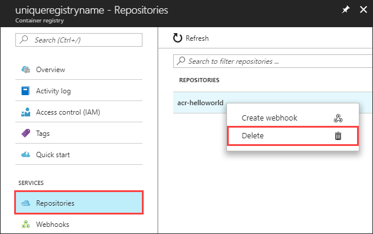

# Azure Container Registry SKUs

Azure Container Registry (ACR) is available in multiple service tiers, known as SKUs. These SKUs provide predictable pricing and several options for how you wish to use your private Docker registry in Azure. Choosing a higher-level SKU provides more performance and scale. However, all SKUs provide the same programmatic capabilities, enabling a developer to get started with Basic, and convert to Standard and Premium as registry usage increases.

## Basic
A cost-optimized entry point for developers learning about Azure Container Registry. Basic registries have the same programmatic capabilities as Standard and Premium (Azure Active Directory authentication integration, image deletion, and web hooks), however, there are size and usage constraints.

## Standard
Standard registries offer the same capabilities as Basic, with increased storage limits and image throughput. Standard registries should satisfy the needs of most production scenarios.

## Premium
Premium registries provide higher limits on constraints such as storage and concurrent operations, enabling high-volume scenarios. In addition to higher image throughput capacity, Premium adds features like [geo-replication](container-registry-geo-replication.md) for managing a single registry across multiple regions, maintaining a network-close registry to each deployment.

## Classic
The Classic registry SKU enabled the initial release of the Azure Container Registry service in Azure. Classic registries are backed by a storage account that Azure creates in your subscription, which limits the ability for ACR to provide higher-level capabilities such as increased throughput and geo-replication. Because of its limited capabilities, we plan to deprecate the Classic SKU in the future.

> [!NOTE]
> Because of the planned deprecation of the Classic registry SKU, we recommend you use Basic, Standard, or Premium for all new registries. For information about converting your existing Classic registry, see [Upgrade a Classic registry](container-registry-upgrade.md).
>

## Managed and unmanaged registries

In this article, we refer to Basic, Standard, and Premium registries as *managed* registries, and Classic registries as *unmanaged*. The primary differentiator between the two is how your container images are stored.

### Managed (Basic, Standard, Premium)

Managed registries are backed by an Azure Storage account managed by Azure. That is, the storage account that stores your images does not appear within your Azure subscription. There are several benefits gained by using one of the managed registry SKUs, discussed in-depth [Upgrade a Classic registry](container-registry-upgrade.md).

### Unmanaged (Classic)

Classic registries are "unmanaged" in the sense that the storage account that backs a Classic registry resides within your Azure subscription. As such, you are responsible for the management of the storage account in which your container images are stored. With unamanaged registries, you can't switch between SKUs as your needs change (other than upgrading to a managed registry), and several features of managed registries are unavailable (for example, [geo-replication](container-registry-geo-replication.md) and [webhooks](container-registry-webhook.md)).

For more information about upgrading a Classic registry to one of the managed SKUs, see [Upgrade a Classic registry](container-registry-upgrade.md).

## Registry SKU feature matrix

The following table details the features and limits of the Basic, Standard, and Premium service tiers.

[!INCLUDE [container-instances-limits](../../includes/container-registry-limits.md)]

## Manage registry size
The storage constraints of each SKU are intended to align with a typical scenario: Basic for getting started, Standard for the majority of production apps, and Premium for hyper-scale performance and [geo-replication](container-registry-geo-replication.md). Throughout the life of your registry, you should manage its size by periodically deleting unused content.

You can find the current usage of a registry in the container registry **Overview** in the Azure portal:

You can manage the size of your registry by deleting repositories in the Azure portal.

Under **SERVICES**, select **Repositories**, then right-click the repository you want to delete, then select **Delete**.

## Changing SKUs

You can change a registry's SKU in the Azure portal.

In the registry **Overview** in the Azure portal, select **Update**, then select a new **SKU** from the SKU drop-down.

## Changing from Classic

There are additional considerations to take into account when migrating an unmanaged Classic registry to one of the managed Basic, Standard, or Premium SKUs. If your registry contains a large number of images and is many gigabytes in size, the migration process can take some time. Additionally, `docker push` operations are disabled until the migration is complete.

For details on upgrading your Classic registry to one of the managed SKUs, see [Upgrade a Classic container registry](container-registry-upgrade.md).

## Pricing

For pricing information on each of the Azure Container Registry SKUs, see [Container Registry pricing](https://azure.microsoft.com/pricing/details/container-registry/).

## Next steps

**Azure Container Registry Roadmap**

Visit the [ACR Roadmap](https://aka.ms/acr/roadmap) on GitHub to find information about upcoming features in the service.

**Azure Container Registry UserVoice**

Submit and vote on new feature suggestions in [ACR UserVoice](https://feedback.azure.com/forums/903958-azure-container-registry).