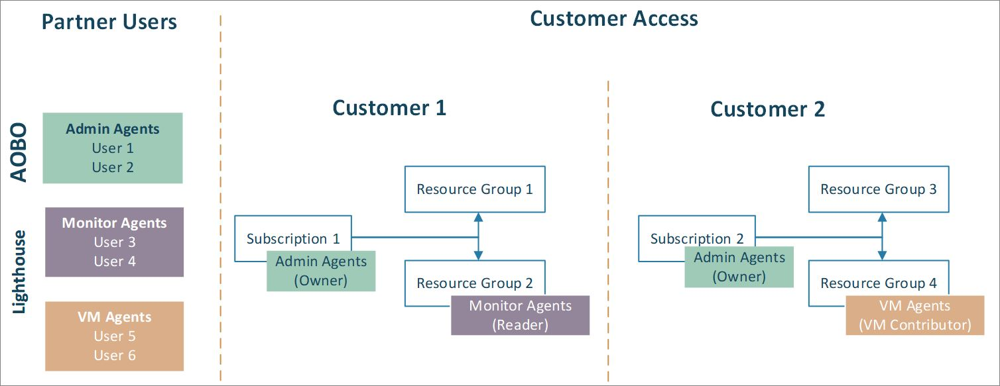

# Azure Lighthouse and the Cloud Solution Provider program

If you're a [CSP (Cloud Solution Provider)](https://docs.microsoft.com/partner-center/csp-overview) partner, you can already access the Azure subscriptions created for your customers through the CSP program by using the [Administer On Behalf Of (AOBO)](https://channel9.msdn.com/Series/cspdev/Module-11-Admin-On-Behalf-Of-AOBO) functionality. This access allows you to directly support, configure, and manage your customers' subscriptions.

With Azure Lighthouse, you can use Azure delegated resource management along with AOBO. This helps improve security and reduces unnecessary access by enabling more granular permissions for your users. It also allows for greater efficiency and scalability, as your users can work across multiple customer subscriptions using a single login in your tenant.

## Administer on Behalf of (AOBO)

With AOBO, any user with the [Admin Agent](https://docs.microsoft.com/partner-center/permissions-overview#manage-commercial-transactions-in-partner-center-azure-ad-and-csp-roles) role in your tenant will have AOBO access to Azure subscriptions that you create through the CSP program. Any users who need access to any customers' subscriptions must be a member of this group. AOBO doesn’t allow the flexibility to create distinct groups that work with different customers, or to enable different roles for groups or users.

## Azure delegated resource management

Using Azure delegated resource management, you can assign different groups to different customers or roles, as shown in the following diagram. Because users will have the appropriate level of access through Azure delegated resource management, you can reduce the number of users who have the Admin Agent role (and thus have full AOBO access). This provides greater security by limiting unnecessary access to your customers’ resources. It also gives you more flexibility to manage multiple customers at scale.

Onboarding a subscription that you created through the CSP program follows the steps described in [Onboard a subscription to Azure delegated resource management](../how-to/onboard-customer.md). Any user who has the Admin Agent role in your tenant can perform this onboarding.

## Partner Admin Link

Be sure to associate your Microsoft Partner Network (MPN) ID with onboarded subscriptions to track your impact across customer engagements.

If you [publish a managed services offer to the Azure Marketplace](../how-to/publish-managed-services-offers.md), your MPN ID is associated with your publisher profile and is automatically associated with the offer. If you [onboard customers for Azure delegated resource management using Azure Resource Manager templates](../how-to/onboard-customer.md), you can still associate your MPN ID in order to receive recognition for your impact on customer engagements, but you will have to do so manually. For more info, see [Link a partner ID to your Azure accounts](https://docs.microsoft.com/azure/billing/billing-partner-admin-link-started). 

## Next steps

- Learn about [cross-tenant management experiences](cross-tenant-management-experience.md).
- Learn about the [Cloud Solution Provider program](https://docs.microsoft.com/partner-center/csp-overview).
